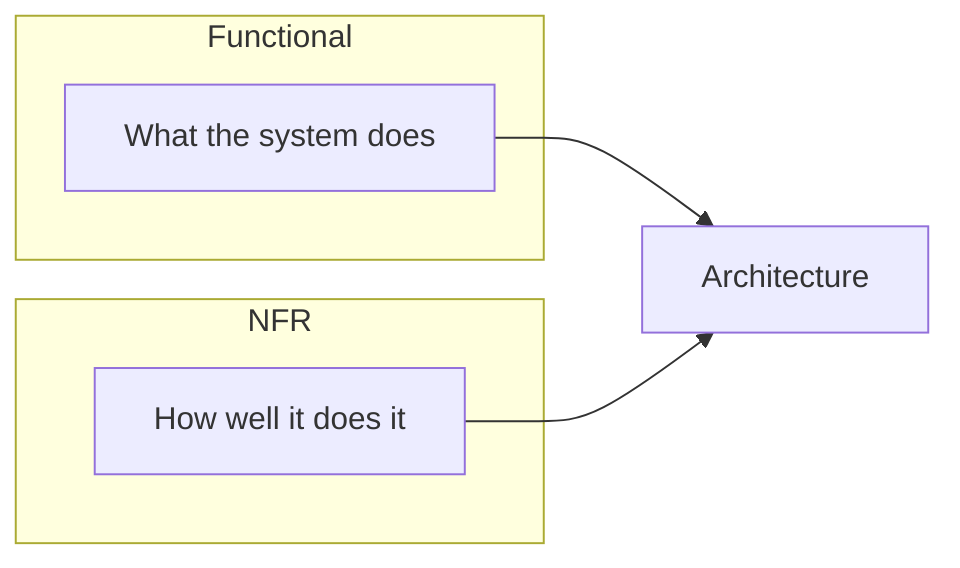

# Functional vs Non-Functional Requirements

The **what** vs the **how well**. Both are critical for system design success.

## 1. The Car Analogy

<Callout variant="tip" title="Simple analogy">
When buying a car, you have two types of needs:

**Functional (what it does):** Gets you from A to B, has 4 seats, trunk space, AC, radio.

**Non-functional (how well it does it):** 0-60 in 5 seconds (performance), 50 MPG (efficiency), 5-star safety rating (reliability), comfortable seats (usability).

A car that "drives" is not enough. **How well** it drives matters for customer satisfaction.
</Callout>

## 2. Functional Requirements

Functional requirements describe **what** the system should do—the features, behaviors, and capabilities users expect. They answer: *Can the system do X?*

### Examples for Twitter

- Users can create an account
- Users can post tweets (280 chars)
- Users can follow other users
- Users can like and retweet
- Users can see a timeline of tweets
- Users can search for tweets and users
- Users can send direct messages
- Users can upload images and videos

<Callout variant="info" title="Interview tip">
Always clarify functional requirements first. Ask: *What are the core features we must support? What can we deprioritize for this discussion?*
</Callout>

## 3. Non-Functional Requirements (NFRs)

Non-functional requirements describe **how well** the system performs—quality attributes like speed, reliability, and security. They answer: *How fast? How reliable? How secure?*

### Performance

- Page load under 2 seconds
- API response under 100ms
- Support 10,000 concurrent users

### Scalability

- Handle 10x traffic during peak
- Scale from 1M to 100M users
- Add capacity without downtime

### Availability

- 99.99% uptime (four nines)
- No more than ~52 minutes downtime per year
- Survive single data center failure

### Reliability

- No data loss ever
- Messages delivered at least once
- Transactions are atomic

### Security

- All data encrypted at rest and in transit
- Authentication required
- Rate limiting against abuse

### Maintainability

- Easy to deploy updates
- Clear monitoring and alerting
- Well-documented APIs

## 4. Side-by-Side Comparison

<ComparisonTable
  headers={['Aspect', 'Functional', 'Non-Functional']}
  rows={[
    ['Focus', 'What the system does', 'How well it does it'],
    ['Example', 'User can upload photo', 'Upload completes in under 3 sec'],
    ['Testing', 'Does feature work? Yes/No', 'Measured with metrics'],
    ['Source', 'Business / Product teams', 'Engineering / Operations'],
    ['Impact', 'User features', 'User experience'],
  ]}
/>

## 5. Real Example: URL Shortener

### Functional requirements

- Given a long URL, generate a short URL
- When user visits short URL, redirect to original
- Users can create custom short URLs
- URLs can have expiration dates
- Track click analytics

### Non-functional requirements

- Redirect latency under 50ms
- 99.99% availability
- Handle 100K redirects per second
- Store 100 billion URLs
- Short URLs should be unpredictable (security)

## 6. Interview Strategy

1. **Ask about scale** — How many users? How many requests per second? How much data?
2. **Clarify availability needs** — What is acceptable downtime? Is 99.9% enough or do we need 99.99%?
3. **Understand latency requirements** — What response time do users expect? Is this real-time or can it be eventual?
4. **Discuss consistency vs availability** — Is it okay if data is slightly stale? Or must reads always see latest writes?

## 7. Key Takeaways

<SummaryBox title="Key takeaways">
1. **Functional requirements** = features (**what**). **Non-functional** = quality (**how well**).
2. Both are equally important—a fast system with missing features is useless, and vice versa.
3. **NFRs drive architecture** decisions: caching for performance, replication for availability.
4. **Always quantify NFRs:** "fast" is vague; "under 100ms p99 latency" is measurable.
5. In interviews, **ask about both** before designing. It shows maturity.
6. **Trade-offs** often exist between NFRs: higher consistency may mean lower availability.
</SummaryBox>
