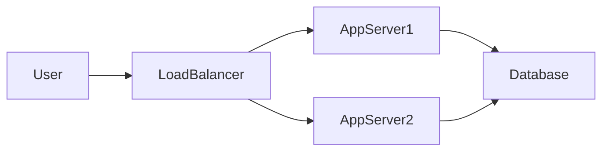

# What is System Design

## Definition

**System design** is the process of defining the architecture, components, modules, interfaces, and data flow for a system to satisfy specified requirements. It is a critical skill for software engineers building scalable, reliable, and maintainable applications.

## Why System Design Matters

<Callout variant="tip" title="Why this skill pays off">
System design rounds are common in senior and staff engineer interviews at top tech companies. The ability to design systems that scale saves companies millions and prevents outages. Good design documents align teams and stakeholders.
</Callout>

- **Interview staple**: System design rounds are common in senior and staff engineer interviews at top tech companies.
- **Real-world impact**: The ability to design systems that scale saves companies millions and prevents outages.
- **Cross-functional clarity**: Good design documents align teams and stakeholders on how the system works.
- **Technical leadership**: Senior engineers are expected to make architecture decisions and trade-offs.

## Key Goals of System Design

1. **Scalability** — The system should handle growth in users, data, and traffic.
2. **Reliability** — The system should be available and correct under failure conditions.
3. **Performance** — Low latency and high throughput where required.
4. **Maintainability** — Clear boundaries and documentation so the system can evolve.
5. **Cost-effectiveness** — Balance infrastructure and engineering cost with business needs.

## Simple Architecture Example

A minimal web application often looks like this: the user talks to a load balancer, which distributes requests across app servers, which in turn read and write to a database.

<DiagramBlock
  chart="sequenceDiagram
    participant User
    participant LB as Load Balancer
    participant App as App Server
    participant DB as Database
    User->>LB: Request
    LB->>App: Forward
    App->>DB: Query
    DB-->>App: Result
    App-->>LB: Response
    LB-->>User: Response"
  title="Request flow: User to Load Balancer to App Server to Database"
/>

The same flow as a high-level component diagram:

This pattern separates concerns: the load balancer handles distribution, app servers handle business logic, and the database persists state.

## Summary

<SummaryBox title="Key takeaways">
- **System design** is the process of defining architecture and components to meet requirements.
- It matters for **interviews**, **scalability**, and **technical leadership**.
- Key goals include scalability, reliability, performance, maintainability, and cost.
- A simple architecture often involves: User → Load Balancer → App Server(s) → Database.
- As systems grow, you add caching, queues, and more services; the fundamentals stay the same.
</SummaryBox>
