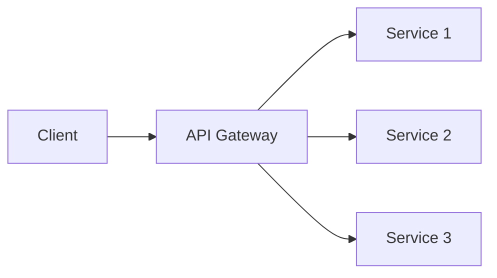

# API Gateway

## Introduction

An **API gateway** is a single entry point for client requests to backend services. It handles routing, authentication, rate limiting, and often request/response transformation.

## Responsibilities

- **Routing**: Forward requests to the right service based on path, method, or headers.
- **Auth**: Validate API keys, JWT, or other credentials before forwarding.
- **Rate limiting**: Throttle clients to protect backends.
- **Aggregation**: Combine multiple backend calls into one response (BFF pattern).

<Callout variant="info" title="Single entry point">
Clients talk only to the gateway. Backend services can be internal; the gateway hides topology and handles cross-cutting concerns.
</Callout>

## Summary

<SummaryBox title="Key takeaways">
- API gateways centralize auth, rate limiting, and routing as a single entry point for clients.
- Use for microservices to expose one API and protect backend services.
</SummaryBox>
