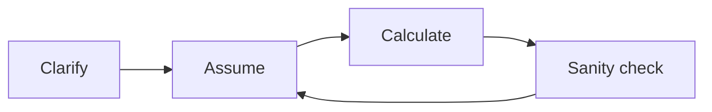

# Back-of-Envelope Estimation

The art of **quickly sizing** systems with round numbers and clear assumptions. Essential for **system design interviews** and **capacity planning** — not for accounting-grade precision.

**Tables** below pack reference numbers; **narrative** walks through how to use them. Plug your own assumptions into the calculator at the top.

<BackOfEnvelopeCalculator />

## Why estimation matters

<MetricTable
  title="Why bother with napkin math?"
  subtitle="Same idea as civil engineering: rough load before you pour concrete."
  columns={['Angle', 'Why it matters']}
  accentLastColumn
  rows={[
    ['Right-size infra', 'Avoid huge waste (over-provisioning) and surprise outages (under-provisioning).'],
    ['Interviews', 'Interviewers expect you to derive QPS, storage, and bandwidth from stated or assumed scale.'],
    ['Justify design', '“We need sharding” lands better when tied to “~10¹² rows won’t fit one host comfortably.”'],
    ['Compare options', 'Redis vs DB, sync vs async, batch vs stream — rough costs clarify trade-offs.'],
  ]}
/>

<Callout variant="tip" title="Process beats precision">
You don’t need exact numbers. Use **powers of 10 (or 2)** and **round aggressively**. Being off by **2×** is usually fine; **100×** means revisit assumptions.
</Callout>

## Numbers worth memorizing

### Powers of 2 (data sizes)

<MetricTable
  title="Powers of 2 — sizes"
  subtitle="Interviews often use 2¹⁰ ≈ 10³ as “close enough.”"
  columns={['Power', 'Exact', '≈ Round', 'Name']}
  compact
  rows={[
    ['2¹⁰', '1,024', '~1 thousand', '1 KB'],
    ['2²⁰', '1,048,576', '~1 million', '1 MB'],
    ['2³⁰', '1,073,741,824', '~1 billion', '1 GB'],
    ['2⁴⁰', '1,099,511,627,776', '~1 trillion', '1 TB'],
    ['2⁵⁰', '1,125,899,906,842,624', '~1 quadrillion', '1 PB'],
  ]}
/>

### Time buckets

<MetricTable
  title="Time — seconds per period"
  subtitle="86,400 s/day is the workhorse for QPS."
  columns={['Period', 'Seconds', '~Round']}
  compact
  rows={[
    ['Day', '86,400', '~10⁵ (napkin)'],
    ['Month (30 d)', '2,592,000', '~2.6M'],
    ['Year (365 d)', '31,536,000', '~3.15 × 10⁷'],
    ['Requests/day @ 1 QPS', '86,400', '~100K'],
  ]}
/>

### Latency hierarchy (order of magnitude)

<MetricTable
  title="How far is the data?"
  subtitle="Rough hardware / network — actual systems vary with load and tuning."
  columns={['Operation', '~Latency']}
  rows={[
    ['L1 cache reference', '~1 ns'],
    ['L2 cache reference', '~4 ns'],
    ['RAM reference', '~100 ns'],
    ['SSD random read', '~10–150 μs'],
    ['HDD seek', '~10 ms'],
    ['Same datacenter RTT', '~0.5 ms'],
    ['Cross-continent RTT', '~150 ms'],
  ]}
/>

**Rule of thumb:** each step down the memory hierarchy is often **~10–1000×** slower — which is why **caching** and **locality** matter.

### Typical payload sizes

<MetricTable
  title="Ballpark object sizes"
  subtitle="Use these to sanity-check bandwidth and storage story problems."
  columns={['Kind', '~Size']}
  compact
  rows={[
    ['Tweet / short text', '~200 B – 1 KB'],
    ['Metadata / small JSON record', '~1 KB'],
    ['Compressed image (feed)', '~100–300 KB'],
    ['Web page (HTML+assets, varies)', '~1–3 MB'],
    ['HD video (~1 min)', '~50 MB'],
    ['4K video (~1 min)', '~200–400 MB'],
  ]}
/>

## The estimation framework

<MetricTable
  title="Four steps (every time)"
  columns={['Step', 'What to do']}
  rows={[
    ['1. Clarify scope', 'What are we sizing? Peak QPS? 5-year storage? Egress cost?'],
    ['2. State assumptions', '“Assume 100M DAU, 10 actions/user/day…” — invites interviewer correction.'],
    ['3. Calculate in steps', 'Multiply/divide in small lines so mistakes are easy to spot.'],
    ['4. Sanity check', 'Tie to intuition: “That’s ~X TB/day — comparable to a large …”'],
  ]}
/>

## Common estimation scenarios

Use these worked examples as templates; **your** interviewer may change DAU, ratios, or payload sizes.

  

    QPS — Twitter-like timeline reads
  

  

    
Estimate average and peak QPS for a Twitter-like service with <strong>300M MAU</strong>.

    <ol className="mb-3 list-decimal space-y-2 pl-5">
      <li>MAU = 300M</li>
      <li>Assume DAU ≈ 50% of MAU → <strong>150M DAU</strong></li>
      <li>Each user loads timeline ~10× / day</li>
      <li>Daily reads ≈ 150M × 10 = <strong>1.5B / day</strong></li>
      <li>Avg QPS ≈ 1.5×10⁹ ÷ 86,400 ≈ <strong>17,400 QPS</strong></li>
      <li>Peak ≈ 2× average → <strong>~35K QPS</strong> (use 3× if they want a spikier product)</li>
    </ol>
    

      <strong>Result:</strong> ~17K QPS average, ~35K QPS peak (order-of-magnitude).
    

  

  

    Storage — tweets over 5 years (text only)
  

  

    
How much storage for <strong>500M tweets/day</strong>, <strong>200 B</strong> average text, <strong>5 years</strong>, <strong>3× replication</strong>?

    <ol className="mb-3 list-decimal space-y-2 pl-5">
      <li>Daily raw ≈ 500M × 200 B = 100 GB/day</li>
      <li>Yearly ≈ 100 GB × 365 ≈ <strong>36.5 TB/year</strong></li>
      <li>5 years raw ≈ 36.5 × 5 ≈ <strong>182 TB</strong></li>
      <li>With 3× replication ≈ 182 × 3 ≈ <strong>550 TB</strong></li>
    </ol>
    

      <strong>Result:</strong> ~550 TB for replicated text (ignoring media, indexes, and compaction overhead).
    

  

  

    Bandwidth — image-heavy feed (illustrative)
  

  

    
Rough <strong>egress</strong> if <strong>500M DAU</strong> each fetch <strong>20 images/day</strong> at <strong>200 KB</strong> each.

    <ol className="mb-3 list-decimal space-y-2 pl-5">
      <li>Daily bytes ≈ 500M × 20 × 200 KB = 2×10⁶ × 10⁹ B ≈ <strong>2 PB/day</strong> (decimal KB)</li>
      <li>Per second ≈ 2×10¹⁵ B ÷ 86,400 ≈ <strong>23 GB/s</strong></li>
      <li>In bits ≈ 23 × 8 ≈ <strong>184 Gbps</strong> (order-of-magnitude)</li>
    </ol>
    

      <strong>Note:</strong> Real CDNs cache at the edge; origin bandwidth is much lower. This models “bytes leaving the platform” if everything went through one pipe.
    

  

## Quick reference formulas

<MetricTable
  title="Formulas you’ll reuse"
  subtitle="Match units (bytes vs bits) and say whether you mean average or peak."
  columns={['Goal', 'Shape', 'Example']}
  compact
  rows={[
    ['QPS from DAU', '(DAU × actions/day) ÷ 86,400', '100M × 10 ÷ 86.4K ≈ 11.6K QPS'],
    ['Storage / year', 'items/day × size × 365', '1M rows × 1 KB × 365 ≈ 365 GB/year'],
    ['Egress bandwidth', 'QPS × response bytes (then ×8 for bits)', '10K × 100 KB ≈ 1 GB/s ≈ 8 Gbps'],
    ['App servers (rough)', '⌈peak QPS ÷ per-server QPS⌉', '100K ÷ 10K = 10 servers'],
    ['Working-set cache', 'hot fraction × total data', '“Top 20% of keys → 80% reads” (80/20 rule of thumb)'],
    ['Replicated storage', 'raw × replication factor', '1 TB × 3 replicas → 3 TB footprint'],
  ]}
/>

## Practice: URL shortener

<Callout variant="tip" title="Try this yourself first">
Estimate: **writes/day**, **read QPS**, **10-year storage** for something like bit.ly.
</Callout>

**Sample assumptions:** 100M new URLs/month, **100:1** read:write, **~500 B** per stored mapping (short key + long URL + metadata).

<MetricTable
  title="Sample answer (napkin)"
  columns={['Question', 'Sketch']}
  rows={[
    ['Write QPS', '100M ÷ (30 × 86,400) ≈ 39 QPS average'],
    ['Read QPS', '39 × 100 ≈ 4,000 QPS average (peak higher)'],
    ['10-year storage', '100M × 12 × 10 × 500 B ≈ 6 TB raw; ×3 replication ≈ 18 TB'],
  ]}
/>

## Common mistakes

<MetricTable
  title="Don’t lose easy points"
  columns={['Mistake', 'Fix']}
  compact
  accentLastColumn
  rows={[
    ['Forgetting peak vs average', 'Call out peak multiplier (often 2–10×). Design capacity for peak; cost may track average.'],
    ['Ignoring replication', 'Say “raw × 3” (or N) for HA — storage and write paths multiply.'],
    ['Mixing seconds and milliseconds; bits and bytes', 'Label units every line. Bandwidth often quoted in bits/sec.'],
    ['Silent assumptions', 'Prefix with “Assuming …” so the interviewer can steer you.'],
    ['One-shot giant multiply', 'Show steps — easier to debug and signals rigor.'],
  ]}
/>

## Key takeaways

<SummaryBox title="Back-of-envelope — recap">
- Memorize **86,400 s/day**, **powers of 2 / 10**, and the **latency ladder** (cache → RAM → disk → network).
- Follow **clarify → assume → calculate → sanity check**; **process** beats the exact digit.
- Always touch **peak**, **replication**, and **units** (B vs b, s vs ms).
- Relate answers to **known systems** or **physical limits** as a smell test.
- Use the **calculator** above to build intuition; then do the same on a **whiteboard** without tooling.
</SummaryBox>
