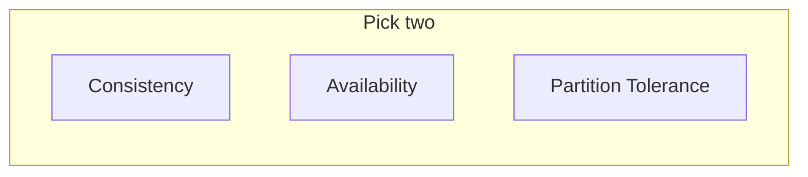

# CAP Theorem

## Introduction

The **CAP theorem** states that a distributed system can provide at most two of the following three guarantees at once:

- **Consistency**: Every read receives the most recent write or an error.
- **Availability**: Every request receives a non-error response.
- **Partition tolerance**: The system continues to operate despite network partitions.

In practice, partition tolerance is assumed (networks fail), so the trade-off is between **consistency** and **availability** under partitions.

## Implications

- **CP systems**: Prefer consistency; may reject requests or become unavailable during partitions (e.g. strongly consistent databases).
- **AP systems**: Prefer availability; may return stale data during partitions (e.g. eventually consistent stores).

<Callout variant="info" title="In practice">
Most distributed systems choose AP (availability) and use eventual consistency. Strong consistency (CP) is used when correctness is critical (e.g. financial transactions).
</Callout>

## Summary

<SummaryBox title="Key takeaways">
- CAP: you cannot have consistency, availability, and partition tolerance all at once under partitions.
- **CP**: consistency over availability; **AP**: availability over consistency (eventual consistency).
- Choose based on whether your use case can tolerate eventual consistency (AP) or needs strong consistency (CP).
</SummaryBox>
