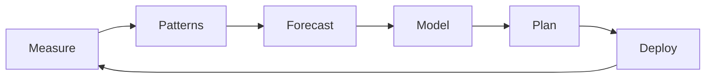

# Capacity Planning

The **strategic** process of deciding **how much** infrastructure you need to meet **current and future** demand — without **overspending** or **running out of runway** when traffic spikes.

Use **tables** for reference patterns; follow the **process** when you do this for real systems.

## What is capacity planning?

<MetricTable
  title="Wedding analogy → production systems"
  subtitle="Same trade-off: too little fails the event; too much wastes budget."
  columns={['Wedding planning', 'Capacity planning']}
  rows={[
    ['💒 How many guests?', 'How many RPS, GB/day, concurrent users?'],
    ['🍽️ How much food?', 'CPU, RAM, DB IOPS, queue depth'],
    ['🪑 Tables / staff?', 'App servers, replicas, CDN PoPs, broker partitions'],
    ['😰 Too little', 'Latency, errors, dropped work'],
    ['💸 Too much', 'Idle VMs, oversized DB tiers, shelfware licenses'],
  ]}
/>

**Formal definition:** Capacity planning is deciding **production capacity** to meet **changing demand**. You look at **current usage**, **forecast** growth, **provision** resources, and **balance** cost vs performance.

### Dimensions you usually size

<MetricTable
  title="What “capacity” includes"
  columns={['Dimension', 'Typical knobs']}
  compact
  rows={[
    ['🖥️ Compute', 'vCPU / cores, RAM, instance count, K8s pods, container concurrency'],
    ['💾 Storage', 'Disk size, IOPS & throughput, SSD vs HDD, object vs block, backup retention'],
    ['🌐 Network', 'Egress bandwidth, connections/sec, latency SLOs, CDN cache & PoPs'],
    ['🔗 Dependencies', 'DB connections, API rate limits, third-party quotas — often the real ceiling'],
  ]}
/>

## The capacity planning process

### 1. Gather current metrics

Collect **CPU, memory, disk I/O, network, request rates, queue depth, error rates** — ideally with **percentiles** (p95/p99), not just averages.

**Tools:** Prometheus + Grafana, Datadog, New Relic, CloudWatch, vendor-native observability.

### 2. Analyze usage patterns

Find **peak hours**, **seasonality**, **campaign spikes**, and **week vs weekend**. Ask: *What triggers spikes? How fast do they ramp?*

### 3. Forecast future demand

Use **business inputs** (launches, markets, pricing) plus **historical growth**. Separate **baseline** from **one-off events** (e.g. Black Friday).

### 4. Model scenarios

Build **baseline**, **aggressive growth**, and **stress** cases. Many teams target **~2× headroom** on critical paths for expected peak (policy varies).

### 5. Plan infrastructure changes

Decide **what** to add: larger instances, **more replicas**, **new region**, **read replicas**, **cache tier**, **CDN**, **partitioning** — and **in what order** (dependencies first).

### 6. Implement and monitor

Roll out, set **threshold alerts** (saturation, latency, errors), and **revisit** assumptions after major events.

<MetricTable
  title="Process at a glance"
  columns={['Step', 'Focus']}
  compact
  rows={[
    ['1. 📈 Gather metrics', 'Utilization, saturation, latency, errors — by service and dependency'],
    ['2. 📊 Analyze patterns', 'Peaks, seasonality, correlation with product or marketing'],
    ['3. 🔮 Forecast', 'Growth + known events; document assumptions'],
    ['4. 🧩 Model scenarios', 'Baseline / high / worst-case; include headroom policy'],
    ['5. 📋 Plan changes', 'Ordered backlog: DB, app, cache, network, quotas'],
    ['6. ✅ Implement & observe', 'Alerts, reviews, post-mortems after incidents'],
  ]}
/>

## Key metrics to track

<MetricTable
  title="Signals that drive capacity decisions"
  subtitle="Targets are illustrative — align with your SLOs, hardware, and cloud limits."
  columns={['Metric', 'Healthy band (typical)', 'Watch for', 'Notes']}
  compact
  accentLastColumn
  rows={[
    ['CPU utilization', '~40–70% average', 'Sustained >80%', 'Leave room for bursts; watch steal time on VMs'],
    ['Memory', '~60–80% average', '>90% or OOM kills', 'Track leaks; cgroup limits in containers'],
    ['Disk I/O', 'Under ~70% of provisioned IOPS', 'High I/O wait / latency', 'SSD vs HDD; burst credits on cloud volumes'],
    ['Network throughput', 'Under ~60% of link / cap', 'Saturation, drops, retries', 'CDN and compression for egress'],
    ['Request latency', 'p99 within SLO (e.g. under 500 ms, app-specific)', 'Creeping p95/p99', 'Often first user-visible sign of pressure'],
    ['Error rate', 'Under 0.1% (context-dependent)', '5xx spikes with load', 'May indicate timeouts, pool exhaustion, throttling'],
  ]}
/>

<CapacityHeadroomBar />

<Callout variant="warning" title="Avoid planning for 100% utilization">
Aim for **~20–30% headroom** on critical resources so you can absorb **spikes**, **failures**, and **time to scale** (cold starts, provisioning delay, config rollout).
</Callout>

## Capacity planning strategies

<CapacityStrategyCards />

## Example: e-commerce platform (illustrative)

<MetricTable
  title="Current snapshot"
  columns={['Metric', 'Value']}
  rows={[
    ['📦 Daily orders', '~50,000'],
    ['⚡ Peak QPS (API)', '~500'],
    ['⏱️ Avg latency (p50-ish)', '~120 ms'],
    ['🖥️ App server count', '10'],
  ]}
/>

<MetricTable
  title="Forecast — 12 months + holiday"
  columns={['Metric', 'Projection', 'Notes']}
  compact
  rows={[
    ['📦 Daily orders', '~150,000', '~3× baseline growth'],
    ['⚡ Peak QPS', '~1,500', 'Same order-of-magnitude scaling assumption'],
    ['⏱️ Latency SLO', 'Under 100 ms', 'Stricter product goal'],
    ['🎄 Holiday spike', '~3× normal peak', 'Plan capacity for marketing + checkout'],
  ]}
/>

**Example plan (high level):**

- **Compute:** Grow app tier **10 → ~25** steady; **autoscale to ~40** for peaks.  
- **Database:** Larger primary or class upgrade; **read replicas** for catalog/search reads.  
- **Cache:** **Redis** cluster **3 → 6** nodes for session + hot catalog.  
- **CDN:** More **edge PoPs** or higher cache hit ratio for new regions.  
- **Phasing:** **Q1** DB upgrade, **Q2** horizontal app scale, **Q3** CDN / regional expansion.

## Common bottlenecks

<MetricTable
  title="Where systems hit the wall first"
  columns={['Layer', 'Symptoms', 'Directions']}
  compact
  accentLastColumn
  rows={[
    ['🗄️ Database', 'Slow queries, pool exhaustion, replication lag', 'Indexes, replicas, pooling, sharding, caching reads'],
    ['⚙️ Application servers', 'High CPU/RAM, queueing, GC pressure', 'Scale out, profile hot paths, cache, async offload'],
    ['📡 Network', 'Latency, drops, bandwidth pegged', 'CDN, compression, keep-alive, multi-region, bigger pipes'],
    ['🔌 Third-party APIs', '429s, timeouts, variable latency', 'Cache, circuit breakers, backoff, quotas, fallbacks'],
  ]}
/>

## Tools (by job)

<MetricTable
  title="Monitoring, load testing, profiling"
  columns={['Job', 'Examples']}
  compact
  rows={[
    ['📊 Monitoring / dashboards', 'Prometheus + Grafana, Datadog, New Relic, CloudWatch'],
    ['🔥 Load & stress testing', 'k6, Locust, JMeter, Gatling'],
    ['🔬 Profiling & flame graphs', 'pprof, async-profiler, py-spy, perf, browser DevTools'],
  ]}
/>

## Key takeaways

<SummaryBox title="Capacity planning — recap">
- **Goal:** Right **resources**, at the **right time**, at the **right cost** — with margin for reality.
- Watch the **big four** plus **saturation**: CPU, memory, disk I/O, network — and **latency/errors** as early warnings.
- Keep **headroom** (~20–30% is a common rule of thumb); **never** assume you can run at 100% safely.
- **Autoscaling** helps variable load but has **lag**, **limits**, and **cold starts** — still needs policy and testing.
- **Plan for peaks** (marketing, holidays), not just average dashboards.
- Treat capacity planning as **continuous**: review after incidents and on a regular cadence (e.g. monthly light, quarterly deep).
</SummaryBox>
