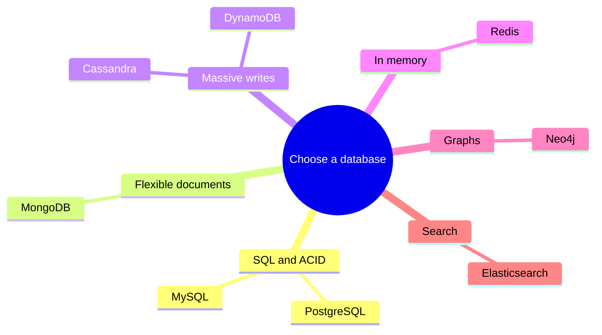

# Choosing the Right Database

Decision framework for selecting databases based on your requirements.

## The tool analogy

<Callout variant="tip" title="Simple analogy">
You wouldn&apos;t use a hammer to cut wood or a saw to drive nails. Different tools for different jobs.

Databases are the same: PostgreSQL for complex queries, Redis for caching, MongoDB for flexible documents, Cassandra for massive writes.

There&apos;s no &quot;best&quot; database-only the best for your specific use case.
</Callout>

## Decision framework

<MetricTable
  title="Decision framework"
  columns={['Question', 'Yes →', 'No →']}
  compact
  rows={[
    [
      'Do you need ACID transactions?',
      'SQL databases (PostgreSQL, MySQL)',
      'Consider NoSQL for flexibility/scale',
    ],
    [
      'Is your schema well-defined and stable?',
      'SQL databases',
      'Document stores (MongoDB) for flexibility',
    ],
    [
      'Do you need complex queries with JOINs?',
      'SQL databases',
      'NoSQL can work with simple queries',
    ],
    [
      'Is write throughput critical (millions/sec)?',
      'Wide-column (Cassandra) or Key-value (Redis)',
      'Most databases will work',
    ],
    [
      'Do you need real-time, sub-millisecond reads?',
      'In-memory (Redis, Memcached)',
      'Disk-based databases are fine',
    ],
    [
      'Are you modeling relationships/graphs?',
      'Graph database (Neo4j)',
      'Relational or document stores',
    ],
  ]}
/>

## Database by use case

<MetricTable
  title="Database by use case"
  columns={['Use case', 'Database', 'Why']}
  compact
  rows={[
    ['E-commerce (orders, inventory)', 'PostgreSQL / MySQL', 'ACID for transactions, complex queries for reporting'],
    ['Social media (posts, feeds)', 'PostgreSQL + Redis', 'SQL for relations, Redis for caching feeds'],
    ['Real-time chat', 'Redis + PostgreSQL', 'Redis for presence/messages, SQL for history'],
    ['IoT sensor data', 'TimescaleDB / InfluxDB', 'Time-series optimized, high write throughput'],
    ['Content management', 'MongoDB', 'Flexible schema for varied content types'],
    ['Session storage', 'Redis', 'Fast reads, built-in expiration'],
    ['Search', 'Elasticsearch', 'Full-text search, relevance scoring'],
    ['Recommendations', 'Neo4j + Redis', 'Graph for relationships, Redis for caching'],
  ]}
/>

## Quick reference table

<DatabaseQuickReferenceTable />

## Polyglot persistence

Polyglot persistence means using multiple databases in one system, each optimized for specific data types and access patterns.

<PolyglotPersistenceStack />

### Complexity trade-off

More databases = more operational complexity. Start simple (one SQL database), then add specialized databases as specific needs arise.

## Key takeaways

<SummaryBox title="Key takeaways">
- No &quot;best&quot; database — choose based on access patterns and requirements.
- Start with PostgreSQL for most applications — it handles 90% of cases.
- Add Redis when you need caching or fast ephemeral storage.
- Use specialized databases (Elasticsearch, Neo4j) for specific needs.
- Polyglot persistence: multiple databases for different data types.
- In interviews: explain WHY you chose a database, not just which one.
</SummaryBox>
