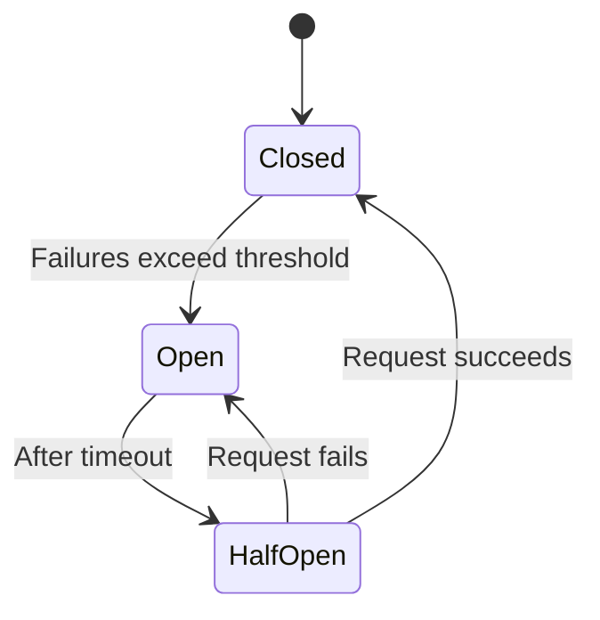

# Circuit Breaker Pattern

## Introduction

A **circuit breaker** prevents an application from repeatedly calling a failing dependency (e.g. another service or DB). After a threshold of failures, the circuit **opens** and calls fail fast instead of timing out, giving the dependency time to recover.

## States

- **Closed**: Requests go through normally. Failures are counted.
- **Open**: After a failure threshold, the circuit opens. Requests **fail immediately** (no call to the dependency).
- **Half-open**: After a timeout, a few requests are allowed through to test if the dependency is back. Success closes the circuit; failure reopens it.

<Callout variant="info" title="Why use it">
Without a circuit breaker, many threads or connections can pile up waiting on a failing service, causing cascading failures. Failing fast preserves resources and often triggers fallbacks (cached data, default response).
</Callout>

## Summary

<SummaryBox title="Key takeaways">
- **Circuit breaker** stops calling a failing dependency after a threshold (open state).
- **Open**: fail fast; **Half-open**: try again; **Closed**: normal operation.
- Use to avoid cascading failures and to give dependencies time to recover.
</SummaryBox>
