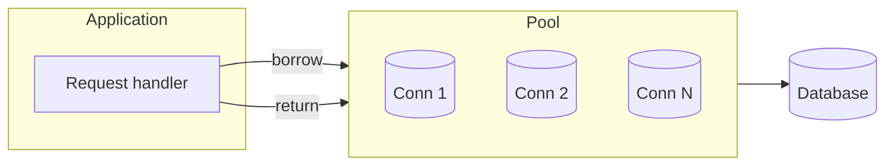

# Connection Pooling

**Connection pooling** reuses open database connections instead of opening and closing one per request. New connections pay for **TCP**, **TLS**, **auth**, and server-side **bookkeeping** — pooling moves that cost off the **hot path** so steady-state queries spend time on **work**, not **handshakes**.

## The phone line analogy

<MetricTable
  title="Simple analogy"
  subtitle="Same idea as HTTP keep-alive, but for DB sessions."
  columns={['Model', 'Mental model']}
  rows={[
    [
      'Without pooling',
      'Every caller provisions a new phone line, talks, then tears the line down. Setup and teardown dominate short conversations.',
    ],
    [
      'With pooling',
      'A fixed set of lines stays up. A caller borrows a free line, uses it, then returns it to the pool for the next caller.',
    ],
  ]}
/>

## Why connection pooling?

Opening a connection is **expensive**: TCP handshake, optional **TLS**, database **authentication**, session state, and memory on both sides. A single new connection often lands in the **tens of milliseconds** range — fine occasionally, painful if you do it **per HTTP request**.

<MetricTable
  title="Order-of-magnitude: one short query (illustrative)"
  subtitle="Real numbers depend on network, TLS, DB, and load — measure in your environment."
  columns={['Path', 'Rough breakdown']}
  compact
  rows={[
    [
      'Without pooling',
      'Open session (often tens of ms) + execute query (~few ms) + close (~small) → setup can dominate latency.',
    ],
    [
      'With pooling',
      'Checkout from pool (~sub-ms to low ms) + execute query (~few ms) + return to pool (~sub-ms) → mostly query time.',
    ],
  ]}
/>

<Callout variant="info" title="Why not one giant shared connection?">
Sessions are **not** safely shared across concurrent requests: each needs **transaction** scope, **prepared statements**, and **session settings**. The pool hands out **one connection per borrower** at a time; the app must **return** it when done.
</Callout>

## How it works

<MetricTable
  title="Lifecycle in four steps"
  columns={['Step', 'What happens']}
  compact
  rows={[
    [
      '1. Initialize pool',
      'At startup (or first use), open up to min pool size connections and keep them warm.',
    ],
    [
      '2. Borrow connection',
      'Application asks the pool for a connection; pool assigns an idle one or waits up to connection timeout.',
    ],
    [
      '3. Execute work',
      'Run queries in a transaction as needed; hold the connection only as long as necessary.',
    ],
    [
      '4. Return connection',
      'Release back to the pool (reset session state if the driver does not) so another request can reuse it.',
    ],
  ]}
/>

## Pool configuration

<MetricTable
  title="Knobs you will see"
  columns={['Setting', 'Role', 'Typical starting range']}
  compact
  rows={[
    [
      'Min pool size',
      'Connections kept warm so the first requests after idle do not always pay a cold open.',
      'Often a small number (for example 5–10) if your traffic is steady.',
    ],
    [
      'Max pool size',
      'Cap on concurrent checked-out connections from this process (or this pooler tier).',
      'Tens per app instance is common; must align with DB max_connections and total instances.',
    ],
    [
      'Connection timeout',
      'How long a thread waits for a free connection before erroring.',
      'Often around 15–30 seconds — tune with overload behavior in mind.',
    ],
    [
      'Idle timeout',
      'Drop connections that sit unused in the pool to free DB resources.',
      'Often minutes (for example 10–30); too aggressive causes churn, too lazy holds slots.',
    ],
    [
      'Max lifetime',
      'Recycle connections periodically to avoid long-lived bad state or imbalanced load.',
      'Often 30–60 minutes; pair with health checks where supported.',
    ],
  ]}
/>

<Callout variant="warning" title="Max pool size multiplies by instance count">
If **100 app servers** each open **100** connections, the database may see **10,000** sessions — often above **max_connections** or unhealthy for memory. **Total concurrency** = roughly **instances × pool max** (plus admin, batch jobs, replicas). Use **PgBouncer** / **RDS Proxy** / similar when many short-lived workers (serverless, high pod count) amplify connection count.
</Callout>

## Popular tools

<MetricTable
  title="Where pooling lives"
  columns={['Tool / layer', 'Notes']}
  compact
  rows={[
    [
      'PgBouncer',
      'Lightweight pooler in front of PostgreSQL; transaction or session pooling modes; common for many app instances or serverless bursts.',
    ],
    [
      'HikariCP',
      'Widely used, performance-focused pool for JVM apps (Spring, etc.).',
    ],
    [
      'ProxySQL',
      'MySQL proxy with pooling, routing, and optional query rules.',
    ],
    [
      'Built-in pools',
      'ORMs and drivers (Prisma, SQLAlchemy, TypeORM, node-pg, etc.) ship pools — still coordinate totals with DB limits and external poolers.',
    ],
  ]}
/>

## Key takeaways

<SummaryBox title="Connection pooling — recap">
- Pooling **reuses** connections so you avoid repeated **TCP + TLS + auth** on every request.
- New connections are often **tens of ms**; checkout from a pool is usually **much cheaper** — measure your stack.
- Tune **min / max**, **timeouts**, and **max lifetime** for **steady load**, **burst**, and **DB limits**; remember **instances × max** toward the server.
- For **many workers** or **serverless**, add a **central pooler** (e.g. PgBouncer) so the database does not see one session per function instance.
- **Always release** connections (try/finally, `using`, or framework equivalents) — **leaks** exhaust the pool and stall traffic.
</SummaryBox>
