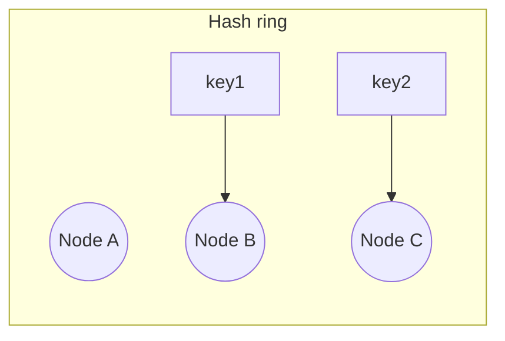

# Consistent Hashing

## Introduction

**Consistent hashing** is a scheme to map keys (e.g. cache keys or data shards) to a fixed set of nodes. When nodes are added or removed, only a **small fraction** of keys move, which minimizes disruption.

## The Problem

With a simple **hash modulo N** (key % N servers), adding or removing one server causes almost all keys to be remapped. That leads to cache stampedes or massive data movement.

## How Consistent Hashing Works

1. Imagine a **ring** (hash ring) with values from 0 to 2^32 - 1.
2. **Nodes** are placed on the ring by hashing their ID (e.g. server name or IP).
3. **Keys** are hashed to a point on the ring. A key is assigned to the **first node clockwise** from that point.

When a node is added or removed, only keys in the segment between the previous and next node move.

<Callout variant="info" title="Virtual nodes">
To balance load, each physical node is represented by many "virtual nodes" on the ring. That way no single node gets a much larger segment.
</Callout>

## Why It Matters

- **Caches**: Adding/removing cache servers; minimal key movement.
- **Sharding**: Assigning data shards to database nodes; rebalancing is localized.
- **CDNs**: Mapping content to edge servers.

## Summary

<SummaryBox title="Key takeaways">
- **Consistent hashing** maps keys to a ring; each key goes to the next node clockwise.
- Adding/removing a node only moves keys in that node's segment.
- **Virtual nodes** improve load balance across physical nodes.
</SummaryBox>
