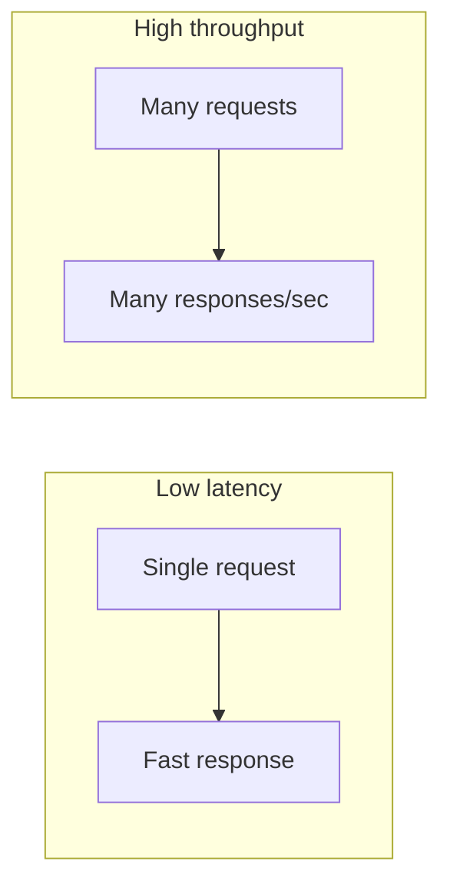

# Core Performance Metrics

## Introduction

Understanding core metrics helps you reason about system performance and capacity in interviews and in production.

## Latency

**Latency** is the time taken for one operation to complete.

- **p50 (median)**: Half of requests complete within this time.
- **p95**: 95% of requests complete within this time.
- **p99**: 99% of requests complete within this time.

<Callout variant="tip" title="Why percentiles?">
Averages can hide outliers. p99 latency tells you the experience of your slowest users and is often used in SLAs.
</Callout>

## Throughput

**Throughput** is the number of operations the system handles per unit time.

- **QPS / RPS**: Queries or requests per second.
- **TPS**: Transactions per second.
- **IOPS**: Input/output operations per second (for storage).

## Relationship

- Improving **latency** (faster single request) does not always improve **throughput**.
- **Throughput** can be increased by adding more workers or replicas.
- **Batching** may increase throughput but add latency.

## Other Important Metrics

- **Error rate**: Fraction of requests that fail.
- **Availability**: Uptime percentage (e.g. 99.9%).
- **Utilization**: How much of capacity is used (CPU, memory, disk).

## Summary

<SummaryBox title="Key takeaways">
- **Latency**: time per operation; use p50, p95, p99.
- **Throughput**: operations per second (QPS, TPS, IOPS).
- **Error rate**, **availability**, **utilization** complete the picture.
</SummaryBox>
