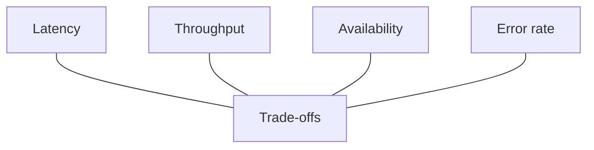

# Core Performance Metrics

The key numbers that define system health: **Latency**, **Throughput**, **Availability**, and **Error Rate**.

## 1. Latency

**Latency** is the time between when a request is sent and when a response is received. **Lower is better.** Users notice anything above about 100ms.

<Callout variant="tip" title="Simple analogy">
Like ordering food: latency is the time from placing your order until food arrives at your table. It includes: waiter to kitchen, cooking time, and bringing food back.
</Callout>

### Types of latency

**Network latency** — Time for data to travel across the network.

- Physical distance, number of hops, congestion, bandwidth
- Example: NYC to London roughly 70ms minimum (speed of light bound)

**Application latency** — Time in your code.

- Algorithm complexity, CPU, memory access, code efficiency
- Example: JSON parsing, business logic, serialization

**Database latency** — Query execution and data return.

- Query complexity, indexes, data volume, connection pool
- Example: Simple lookup 1–5ms; complex join 50–500ms

**Queue / I/O latency** — Waiting in queues or for I/O.

- Queue depth, disk speed, thread pool, contention
- Example: SSD read 1–10ms; HDD 10–100ms

### Latency breakdown: typical web request

<MetricTable
  title="Latency breakdown: typical web request"
  subtitle="Where time goes in a single round trip — sum these to reason about total latency."
  columns={['Step', 'Description', 'Typical range']}
  rows={[
    ['DNS lookup', 'Domain to IP', '1–50ms'],
    ['TCP handshake', '3-way handshake', '10–100ms'],
    ['TLS handshake', 'Certificate exchange', '30–100ms'],
    ['Request transfer', 'Send HTTP request', '5–50ms'],
    ['Server processing', 'Your application', '10–500ms'],
    ['Response transfer', 'Return body', '10–100ms'],
  ]}
  accentLastColumn
/>

**Total:** often roughly **66ms–900ms**, depending on distance and complexity.

### Measuring latency: percentiles matter

**Average latency hides problems.** Use percentiles:

<MetricTable
  title="Measuring latency: percentiles"
  subtitle="Report p50 / p90 / p99 — not just the average."
  columns={['Percentile', 'Meaning', 'Example']}
  rows={[
    ['p50', 'Median — half of requests faster', '45ms'],
    ['p90', '90% of requests faster', '120ms'],
    ['p99', '99% of requests faster', '450ms'],
    ['p99.9', '99.9% of requests faster', '1200ms'],
  ]}
  accentLastColumn
/>

<Callout variant="warning" title="Why p99 matters">
At 1M requests per day, p99 = 450ms means about **10,000 users** experience 450ms+ latency daily. For Amazon, every 100ms latency has been cited as ~1% sales impact. High percentiles = real user pain.
</Callout>

### How to reduce latency

- **Caching** — Store computed results (often 10x–100x: e.g. Redis ~0.5ms vs DB ~50ms)
- **CDN** — Serve content closer to users (often 50–200ms saved)
- **Connection pooling** — Reuse DB connections (save 20–50ms vs new TCP per request)
- **Async processing** — Move slow work off the critical path (emails, notifications)
- **Database indexing** — B-tree indexes on search columns (often 10x–1000x)
- **Compression** — gzip/Brotli responses (smaller transfer)

## 2. Throughput

**Throughput** is how many requests the system handles per unit time. **Higher is better.** Measured in **RPS** (requests per second) or **TPS** (transactions per second).

<Callout variant="tip" title="Simple analogy">
Like a highway: throughput is how many cars pass per hour. More lanes = higher throughput. Accidents (errors) reduce throughput.
</Callout>

### Throughput vs latency

<MetricTable
  title="Throughput vs latency"
  subtitle="Same system — two different questions. Optimize for what your product cares about most."
  columns={['Aspect', 'Latency', 'Throughput']}
  rows={[
    ['Question', 'How fast is one request?', 'How many requests per second?'],
    ['Example', '50ms per request', '1,000 RPS'],
  ]}
/>

**They are related but different:**

- Low latency does not guarantee high throughput (e.g. single-threaded server).
- High load can **increase** latency (queuing) even if peak throughput is high.
- Optimize for what your product cares about most.

### Factors affecting throughput

1. **CPU cores** — More parallel work (ideal: more cores ~ more throughput, with diminishing returns).
2. **Thread / connection pool** — More concurrent handlers (e.g. pool of 100 ≈ up to 100 concurrent requests).
3. **Database connections** — Often the bottleneck (e.g. 100 DB connections cap concurrent queries).
4. **Memory** — More RAM for caches and fewer allocations can raise throughput.

### Real-world throughput (rough orders of magnitude)

<MetricTable
  title="Real-world throughput (rough orders of magnitude)"
  subtitle="Ballpark figures — your workload, hardware, and code path change these a lot."
  columns={['System', 'Throughput', 'Notes']}
  rows={[
    ['Single Node.js', '1K–10K RPS', 'Event loop, single-threaded core'],
    ['Single Go server', '10K–100K RPS', 'Goroutines, multi-core'],
    ['Redis', '100K+ RPS', 'In-memory, simple ops'],
    ['PostgreSQL', '1K–50K QPS', 'Depends heavily on queries'],
    ['Kafka', '1M+ msgs/sec', 'Per broker, sequential I/O'],
  ]}
/>

## 3. Availability

**Availability** is the percentage of time the system is operational. Often expressed as **nines** (e.g. 99.9% = three nines).

<Callout variant="tip" title="Simple analogy">
Like a store open 24/7: if it closes 1 hour per week for maintenance, availability is about 99.4%. Users who arrive then hit **downtime**.
</Callout>

### The nines table

<MetricTable
  title="Availability tiers (the nines)"
  subtitle="Allowed downtime for a non–leap year. Numbers are targets, not guarantees — you still need monitoring and error budgets."
  columns={['Availability', 'Max downtime (year)', 'Max downtime (month)', 'Typical use']}
  compact
  accentLastColumn
  rows={[
    ['99% (two 9s)', '3.65 days', '7.3 hours', 'Internal tools, batch jobs'],
    ['99.9% (three 9s)', '8.76 hours', '43.8 minutes', 'Standard SaaS'],
    ['99.99% (four 9s)', '52.6 minutes', '4.4 minutes', 'E-commerce, payments'],
    ['99.999% (five 9s)', '5.26 minutes', '26 seconds', 'Critical infrastructure'],
  ]}
/>

### Calculating availability

**Components in series** (all must work): multiply availabilities.

Example: LB 99.99% × App 99.9% × DB 99.95% ≈ **99.84%** overall.

**Components in parallel** (redundancy): failure probability drops.

Example: two servers each 99% available → combined ≈ **99.99%** (both down only 0.01% of the time).

### How to achieve high availability

- **Redundancy** — Multiple instances (e.g. 3 app servers, 2 DB replicas).
- **Load balancing** — Route around failed nodes.
- **Health checks** — e.g. `/health` every 10s.
- **Auto-failover** — Promote replica when primary fails.
- **Multi-region** — Survive whole data center loss.
- **Graceful degradation** — Partial service beats total outage (e.g. cache miss still hits DB).

## 4. Error rate

**Error rate** is the fraction of requests that fail. **Lower is better.** Includes **4xx** (client) and **5xx** (server).

### Types of errors

**4xx — client errors**

- 400 Bad Request, 401 Unauthorized, 403 Forbidden, 404 Not Found, 429 Too Many Requests  
- Usually the client’s responsibility; monitor but alert lightly.

**5xx — server errors**

- 500 Internal Error, 502 Bad Gateway, 503 Unavailable, 504 Timeout  
- **Your** problem: alert and fix urgently.

### Error budget

If your SLO is **99.9%** success, you have a **0.1% error budget**:

- **Under budget** — Safer to deploy and experiment.
- **Near budget** — Slow down risky changes.
- **Exhausted** — Freeze deploys; focus on reliability.

### Healthy error rate targets (example)

<MetricTable
  title="Healthy error rate targets"
  subtitle="Example thresholds — tune to your product and error budget."
  columns={['Metric', 'Good', 'Acceptable', 'Critical']}
  rows={[
    ['5xx rate', 'under 0.01%', 'under 0.1%', 'over 1%'],
    ['Timeout rate', 'under 0.1%', 'under 0.5%', 'over 2%'],
    ['4xx rate', 'under 1%', 'under 5%', 'over 10%'],
  ]}
  accentLastColumn
/>

## 5. Putting it all together

### Trade-offs

**Latency vs throughput** — Batching improves throughput but can add latency per item (e.g. send one email now vs batch 100).

**Availability vs consistency** — Reading from replicas improves availability and latency but reads may be stale vs primary.

**Latency vs cost** — Lower global latency often means CDN, multi-region, more capacity (higher cost).

### Typical SLOs by service type

<MetricTable
  title="Typical SLOs by service type"
  subtitle="Starting points for Service Level Objectives — align with stakeholders."
  columns={['Service type', 'Latency (p99)', 'Availability', 'Error rate']}
  rows={[
    ['User-facing API', 'under 200ms', '99.9%', 'under 0.1%'],
    ['Payment', 'under 500ms', '99.99%', 'under 0.01%'],
    ['Search', 'under 100ms', '99.9%', 'under 0.5%'],
    ['Batch / analytics', 'N/A (throughput)', '99%', 'under 1%'],
  ]}
/>

## 6. Try it: latency vs throughput simulator

<LatencyThroughputSimulator />

## 7. Key takeaways

<SummaryBox title="Key takeaways">
1. **Latency** = time for one request. Use **percentiles** (p50, p90, p99), not only averages.
2. **Throughput** = requests per second. Depends on CPU, connections, memory, and bottlenecks like the database.
3. **Availability** = uptime. **Redundancy + failover** add nines.
4. **Error rate** = failures / total. **5xx** = server problem; **4xx** often client or validation.
5. These metrics **trade off**; optimize for what the product needs.
6. Define **SLOs** (Service Level Objectives) for each metric so teams can align.
</SummaryBox>
