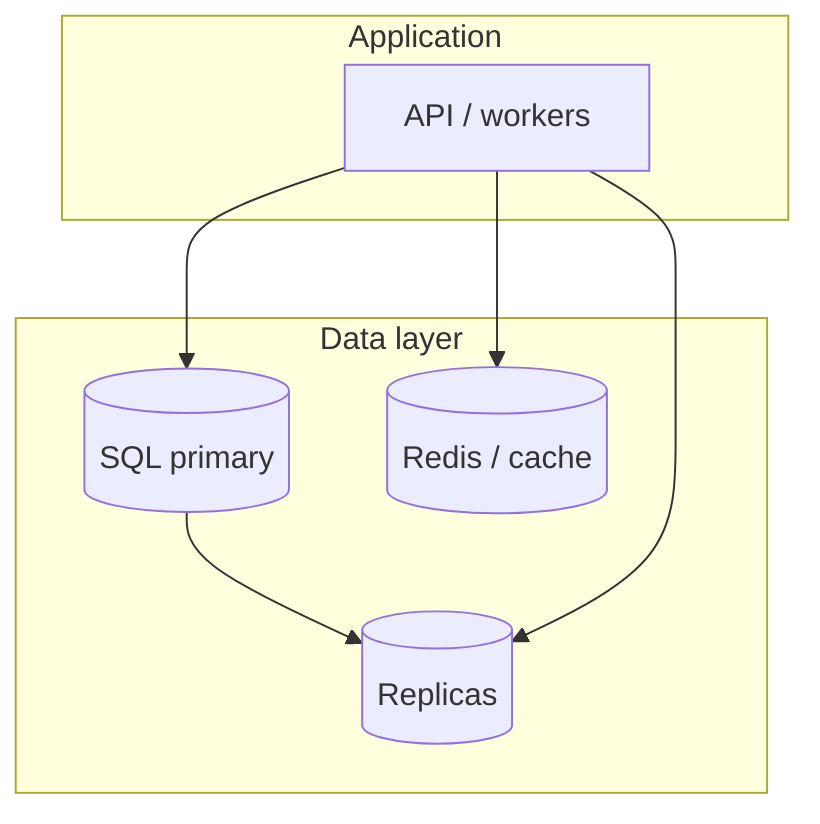

# Database Fundamentals

**SQL vs NoSQL**, **ACID**, and **when to pick what** — the data layer under almost every system. Use **tables** for comparisons; use **boxes** for rules of thumb and examples.

## The filing system analogy

<MetricTable
  title="Spreadsheet vs folders"
  subtitle="Not a perfect mapping, but a fast mental model in interviews."
  columns={['Style', 'Like…', 'Database idea']}
  rows={[
    ['SQL (relational)', 'Excel with strict columns — every row matches the sheet schema', 'Tables, typed columns, JOINs across related rows'],
    ['NoSQL (various)', 'Folders of documents — each file can have different fields', 'Flexible shapes; optimize for access pattern (document, KV, wide-column, graph)'],
  ]}
/>

## SQL (relational) databases

**SQL databases** store rows in **tables** with a declared **schema**. **Foreign keys** express relationships. **SQL** is the standard way to query, aggregate, and join.

### How relational data fits together

**`users`** and **`orders`** — classic **one-to-many** linked by **`user_id`** → **`users.id`**.

<MetricTable
  title="users"
  subtitle="Each row is one person; id is the primary key (PK)."
  columns={['id (PK)', 'name', 'email']}
  rows={[
    ['1', 'Alice', 'alice@mail.com'],
    ['2', 'Bob', 'bob@mail.com'],
  ]}
/>

<MetricTable
  title="orders"
  subtitle="user_id is a foreign key (FK) — it references users.id."
  columns={['id (PK)', 'user_id (FK)', 'total']}
  rows={[
    ['101', '1', '$50'],
    ['102', '1', '$30'],
    ['103', '2', '$75'],
  ]}
/>

```sql
SELECT u.name, o.total
FROM users u
JOIN orders o ON u.id = o.user_id;
```

<MetricTable
  title="Result of the JOIN (example)"
  subtitle="One row per matching pair — Alice appears twice because she has two orders."
  columns={['name', 'total']}
  rows={[
    ['Alice', '$50'],
    ['Alice', '$30'],
    ['Bob', '$75'],
  ]}
/>

<Callout variant="tip" title="Why JOINs matter">
Relational design **normalizes** data to avoid duplication. Reports that span entities are **JOINs** — powerful, but heavy if tables are huge without indexes or if you over-shard.
</Callout>

<MetricTable
  title="Popular SQL engines (high level)"
  subtitle="Production choices vary; teams often cite these — verify for your era and workload."
  columns={['Engine', 'Traits', 'Often mentioned with']}
  compact
  rows={[
    ['PostgreSQL', 'Rich SQL, extensions, JSON columns, strong ecosystem', 'Many greenfield backends, analytics-adjacent workloads'],
    ['MySQL / MariaDB', 'Mature, huge community, replication story', 'LAMP stacks, many web products historically'],
    ['SQL Server', 'Enterprise tooling, Windows / Azure integration', 'Corporate .NET / Microsoft stacks'],
  ]}
/>

## NoSQL databases

**NoSQL** usually means **not only** relational tables — different **data models** and **trade-offs** (scale-out, flexible schema, specialized queries). Consistency models vary (**eventual** is common outside the transaction core).

<MetricTable
  title="Four NoSQL families"
  columns={['Type', 'Examples', 'Shape', 'Often best for']}
  compact
  rows={[
    ['Document', 'MongoDB, CouchDB', 'JSON-like documents; schema flexible per doc', 'Profiles, catalogs, content, evolving objects'],
    ['Key–value', 'Redis, DynamoDB, Memcached', 'Key → blob; O(1) lookups', 'Cache, sessions, leaderboards, feature flags'],
    ['Wide-column', 'Cassandra, HBase, ScyllaDB', 'Sparse rows, partition key + clustering', 'Time-series, high write rates, IoT ingest'],
    ['Graph', 'Neo4j, Amazon Neptune', 'Nodes + edges; traversals first-class', 'Social graph, fraud rings, recommendations'],
  ]}
/>

<details className="group my-3 rounded-xl border border-border bg-card/40 open:bg-muted/20">
  <summary className="cursor-pointer px-4 py-3 font-semibold text-foreground">Document store — tiny example</summary>
  <div className="border-t border-border px-4 py-3 text-sm text-muted-foreground">
    Two users, different fields allowed in the same collection — application validates what it reads.
    <pre className="mt-2 overflow-x-auto rounded-lg bg-muted/50 p-3 font-mono text-xs">{`{ "_id": 1, "name": "Alice", "vip": true }
{ "_id": 2, "name": "Bob", "locale": "de-DE" }`}</pre>
  </div>
</details>

<details className="group my-3 rounded-xl border border-border bg-card/40 open:bg-muted/20">
  <summary className="cursor-pointer px-4 py-3 font-semibold text-foreground">Key–value — tiny example</summary>
  <div className="border-t border-border px-4 py-3 text-sm text-muted-foreground">
    Like a big hash map — values can be strings, bytes, or small structured blobs.
    <pre className="mt-2 overflow-x-auto rounded-lg bg-muted/50 p-3 font-mono text-xs">{`session:abc123  →  serialized user + expiry
cart:user:42     →  JSON cart snapshot`}</pre>
  </div>
</details>

<details className="group my-3 rounded-xl border border-border bg-card/40 open:bg-muted/20">
  <summary className="cursor-pointer px-4 py-3 font-semibold text-foreground">Wide-column — tiny example</summary>
  <div className="border-t border-border px-4 py-3 text-sm text-muted-foreground">
    Rows grouped by **partition key**; columns can be sparse — good for append-heavy timelines.
    <pre className="mt-2 overflow-x-auto rounded-lg bg-muted/50 p-3 font-mono text-xs">{`PK=device_7 | ts=10:01 | temp=22.1
PK=device_7 | ts=10:02 | temp=22.4 | humidity=41`}</pre>
  </div>
</details>

<details className="group my-3 rounded-xl border border-border bg-card/40 open:bg-muted/20">
  <summary className="cursor-pointer px-4 py-3 font-semibold text-foreground">Graph — tiny example</summary>
  <div className="border-t border-border px-4 py-3 text-sm text-muted-foreground">
    Queries follow relationships — “friends of friends who bought X” without giant JOIN explosions in some cases.
    <pre className="mt-2 overflow-x-auto rounded-lg bg-muted/50 p-3 font-mono text-xs">{`(Alice)-[:FOLLOWS]->(Bob)-[:BOUGHT]->(SKU-42)`}</pre>
  </div>
</details>

## SQL vs NoSQL: comparison

<MetricTable
  title="At a glance"
  subtitle="Rules of thumb — exceptions exist (e.g. distributed SQL, Postgres scale-out)."
  columns={['Aspect', 'Typical SQL', 'Typical NoSQL']}
  compact
  rows={[
    ['Schema', 'Fixed upfront; migrations', 'Flexible per model; app enforces shape'],
    ['Scaling reads', 'Replicas, bigger machines, then harder problems', 'Often partition / shard by access pattern'],
    ['Relationships', 'JOINs, FK integrity', 'Embed, duplicate, or app-side joins'],
    ['Transactions', 'Strong ACID common', 'Varies — some offer tunable consistency'],
    ['Query language', 'SQL (standard-ish)', 'Driver-specific APIs, query DSLs'],
    ['Sweet spot', 'Complex queries, reporting, strong invariants', 'Massive partitionable workloads, simple key paths, special models'],
  ]}
/>

## ACID properties

**ACID** describes guarantees many **relational** systems target for **transactions**. Critical when money, inventory, or identity must stay correct under concurrency and failure.

<AcidPropertiesCards />

<Callout variant="warning" title="Not all NoSQL is “non-ACID”">
Some document and wide-column systems offer **multi-document** or **limited** transactions — always read the **docs** for your version. **Isolation levels** in SQL also differ (READ COMMITTED vs SERIALIZABLE).
</Callout>

## When to use what

<div className="not-prose my-6 grid gap-4 md:grid-cols-2">
  <div className="rounded-2xl border border-sky-300/50 bg-sky-500/10 p-5 ring-1 ring-sky-500/15 dark:border-sky-800/40">
    <p className="mb-3 flex items-center gap-2 font-bold text-sky-900 dark:text-sky-100">
      <span className="text-lg" aria-hidden>✓</span>
      Lean SQL when…
    </p>
    <ul className="list-inside list-disc space-y-2 text-sm text-muted-foreground">
      <li>Rich **relationships** (orders → products → categories)</li>
      <li>You need **ad-hoc reports** and **JOINs**</li>
      <li>**ACID** matters (payments, inventory, ledger)</li>
      <li>Schema is **stable** and shared across teams</li>
    </ul>
  </div>
  <div className="rounded-2xl border border-violet-300/50 bg-violet-500/10 p-5 ring-1 ring-violet-500/15 dark:border-violet-800/40">
    <p className="mb-3 flex items-center gap-2 font-bold text-violet-900 dark:text-violet-100">
      <span className="text-lg" aria-hidden>✓</span>
      Lean NoSQL when…
    </p>
    <ul className="list-inside list-disc space-y-2 text-sm text-muted-foreground">
      <li>**Scale-out** and partitionable access patterns</li>
      <li>Schema **evolves fast** or differs per tenant</li>
      <li>Hot path is **simple** (get/put by key or partition)</li>
      <li>**Write-heavy** streams (events, logs, IoT)</li>
    </ul>
  </div>
</div>

<Callout variant="tip" title="Interview: polyglot persistence">
Real stacks mix **PostgreSQL** (core transactional data), **Redis** (cache / sessions), **Elasticsearch** (search), **Cassandra** (feeds / history) — **different jobs**, not “SQL vs NoSQL winner.”
</Callout>

## Real-world examples (illustrative)

<MetricTable
  title="How big products often split data"
  subtitle="Architecture changes over time — treat as patterns, not facts."
  columns={['Company', 'SQL-ish / core', 'NoSQL / specialized']}
  compact
  rows={[
    ['Instagram (pattern)', 'PostgreSQL for relational core', 'Redis cache; wide-column / custom for feed scale'],
    ['Netflix (pattern)', 'MySQL for billing / accounts', 'Cassandra-class stores for viewing history; ElastiCache'],
    ['Uber (pattern)', 'MySQL for core trip / user data', 'Redis for real-time; history in scalable stores'],
  ]}
/>



## Key takeaways

<SummaryBox title="Database fundamentals — recap">
- **SQL** = structured tables, **JOINs**, **schema**, **ACID** transactions — default for many business domains.
- **NoSQL** = multiple models (**document, KV, wide-column, graph**) — match **access pattern** and **scale** needs.
- **ACID** = **Atomicity, Consistency, Isolation, Durability** — the reliability contract for critical transactions.
- Choose by **workload**, not buzzwords — **SQL is often enough** until metrics force otherwise.
- **Polyglot persistence** is normal: one system rarely does cache + search + ledger equally well.
- **Indexes**, **replication**, and **sharding** still apply — whatever the logo on the box.
</SummaryBox>
