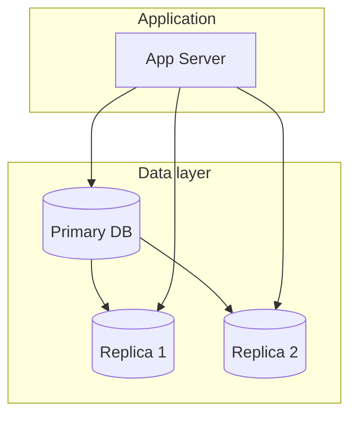

# Database Fundamentals

## Introduction

Databases store and retrieve data for your application. Choosing the right type and using it correctly is central to system design.

## Types of Databases

- **Relational (SQL)**: Tables, rows, columns; ACID transactions; strong consistency. Examples: PostgreSQL, MySQL.
- **NoSQL**: Document, key-value, wide-column, graph; often optimized for scale or flexibility. Examples: MongoDB, Redis, Cassandra.

## Key Concepts

- **Schema**: Structure of your data (columns and types in SQL; document shape in document stores).
- **Index**: Data structure to speed up lookups (e.g. by primary key or indexed column).
- **Transaction**: A group of operations that succeed or fail together (ACID).
- **Replication**: Copying data to multiple nodes for redundancy or read scaling.
- **Sharding**: Splitting data across multiple databases by a key (e.g. user_id).

<Callout variant="tip" title="Read vs write">
Often writes go to the primary; reads can go to replicas. This increases read throughput but may return slightly stale data.
</Callout>

## Summary

<SummaryBox title="Key takeaways">
- **SQL** for structured data and strong consistency; **NoSQL** for scale or flexible schema.
- **Indexes** speed up queries; **replication** and **sharding** help scale.
- Writes to primary; reads from replicas is a common pattern.
</SummaryBox>
