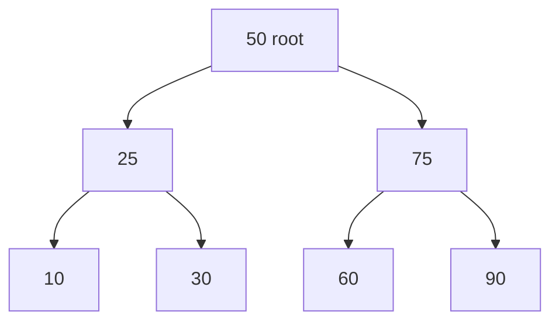

# Database Indexing

**Indexes** tell the database **where to look** instead of scanning every row. Used well, they turn large **sequential scans** into **logarithmic** or **hash** lookups — used badly, they waste **space** and slow **writes**.

## The library analogy

<MetricTable
  title="Card catalog vs wandering the stacks"
  subtitle="Same data — different access path."
  columns={['Situation', 'What happens']}
  rows={[
    ['No index', 'Find “Harry Potter” by checking every shelf → proportional to collection size (O(n) scan idea)'],
    ['With index', 'Catalog points to shelf/row → jump there → much fewer steps (often O(log n) with B-Tree)'],
  ]}
/>

## What is an index?

An **index** is an extra **data structure** (usually sorted or hashed) built from **one or more columns**, storing **pointers** (e.g. row ids / heap locations) to the real rows.

<MetricTable
  title="Table vs index on name (conceptual)"
  subtitle="Index keeps a sorted view of the key for binary search; table heap may be unordered."
  columns={['users (heap order)', 'name', 'email']}
  rows={[
    ['row 1', 'Charlie', 'c@mail.com'],
    ['row 2', 'Alice', 'a@mail.com'],
    ['row 3', 'Bob', 'b@mail.com'],
    ['row 4', 'Diana', 'd@mail.com'],
  ]}
/>

<MetricTable
  title="Index idx_users_name (sorted on name)"
  columns={['name (key)', '→ row']}
  rows={[
    ['Alice', '2'],
    ['Bob', '3'],
    ['Charlie', '1'],
    ['Diana', '4'],
  ]}
/>

<Callout variant="tip" title="Complexity intuition">
**B-Tree** lookups are often **O(log n)** in tree height. **Full table scan** is **O(n)** rows examined — fine for tiny tables, painful for millions of rows.
</Callout>

## Types of indexes

<MetricTable
  title="Families at a glance"
  subtitle="Details below — engines differ; always check your version’s docs."
  columns={['Type', 'Best for', 'Weak at', 'Typical DDL hint']}
  compact
  rows={[
    ['B-Tree (default in Postgres / InnoDB)', '=, range, BETWEEN, ORDER BY on key', 'Full-text; splits on random inserts', 'CREATE INDEX idx ON users(name);'],
    ['Hash', 'Exact equality on key', 'Ranges, ORDER BY, inequality', 'Engine-specific; often B-Tree wins anyway'],
    ['Composite', 'Leftmost prefix of (A,B,…)', 'Filter on B alone when index is (A,B)', 'CREATE INDEX idx ON t(a, b);'],
    ['Full-text', 'Token search + ranking in text', 'Size, language rules, tuning', 'FULLTEXT / GIN / tsvector…'],
  ]}
/>

### B-Tree index

**Most common** in production OLTP. A **balanced** multi-way tree: keys stay **sorted** in nodes so the engine can **binary-search** down from the root and support **=, &lt;, BETWEEN**, and often **ORDER BY** on the indexed key.



<div className="not-prose my-4 grid gap-4 md:grid-cols-2">
  <div className="rounded-xl border border-emerald-300/50 bg-emerald-500/10 p-4 dark:border-emerald-800/40">
    <p className="mb-2 text-xs font-bold uppercase tracking-wide text-emerald-800 dark:text-emerald-300">Pros</p>
    <ul className="list-inside list-disc space-y-1.5 text-sm text-muted-foreground">
      <li>Great for <strong className="text-foreground">=, &lt;, &gt;, BETWEEN</strong></li>
      <li><strong className="text-foreground">Self-balancing</strong> — predictable depth</li>
      <li>Default choice for <strong className="text-foreground">most</strong> predicates</li>
    </ul>
  </div>
  <div className="rounded-xl border border-rose-300/50 bg-rose-500/10 p-4 dark:border-rose-900/40">
    <p className="mb-2 text-xs font-bold uppercase tracking-wide text-rose-800 dark:text-rose-300">Cons</p>
    <ul className="list-inside list-disc space-y-1.5 text-sm text-muted-foreground">
      <li><strong className="text-foreground">Write overhead</strong> — splits / rebalances</li>
      <li>Not a substitute for <strong className="text-foreground">full-text</strong> engines</li>
    </ul>
  </div>
</div>

```sql
CREATE INDEX idx_user_name ON users (name);
```

### Hash index

Uses a **hash function** on the key to pick a **bucket**. **Equality** lookups are very fast; **range** and **sort order** are not meaningful on the hash.

```
key  --hash()-->  bucket 0 | bucket 1 | bucket 2 | ...
                      ^ your row lives in one bucket
```

<div className="not-prose my-4 grid gap-4 md:grid-cols-2">
  <div className="rounded-xl border border-emerald-300/50 bg-emerald-500/10 p-4 dark:border-emerald-800/40">
    <p className="mb-2 text-xs font-bold uppercase tracking-wide text-emerald-800 dark:text-emerald-300">Pros</p>
    <ul className="list-inside list-disc space-y-1.5 text-sm text-muted-foreground">
      <li><strong className="text-foreground">O(1)</strong> bucket lookup for exact key (idealized)</li>
      <li>Very fast <strong className="text-foreground">point</strong> gets when supported</li>
    </ul>
  </div>
  <div className="rounded-xl border border-rose-300/50 bg-rose-500/10 p-4 dark:border-rose-900/40">
    <p className="mb-2 text-xs font-bold uppercase tracking-wide text-rose-800 dark:text-rose-300">Cons</p>
    <ul className="list-inside list-disc space-y-1.5 text-sm text-muted-foreground">
      <li>No <strong className="text-foreground">range</strong> or <strong className="text-foreground">ORDER BY</strong> on hash key</li>
      <li><strong className="text-foreground">Not universal</strong> — many stacks default to B-Tree</li>
    </ul>
  </div>
</div>

```sql
-- Illustrative; syntax and support vary (Postgres: hash access method on some types)
CREATE INDEX idx_session ON sessions USING HASH (session_id);
```

### Composite (multi-column) index

One index over **several columns** — stored as a **composite key** (often sorted lexicographically). **Leftmost prefix rule:** index `(last_name, first_name)` helps queries that constrain **`last_name`**, or **`last_name` + `first_name`**, but usually **not** `WHERE first_name = ?` **alone**.

<MetricTable
  title="Composite key order (example)"
  subtitle="Sorted by (last_name, first_name) — then pointer to row."
  columns={['last_name', 'first_name', '→ row']}
  rows={[
    ['Adams', 'Alice', '5'],
    ['Adams', 'Bob', '2'],
    ['Baker', 'Carol', '1'],
  ]}
/>

<div className="not-prose my-4 grid gap-4 md:grid-cols-2">
  <div className="rounded-xl border border-emerald-300/50 bg-emerald-500/10 p-4 dark:border-emerald-800/40">
    <p className="mb-2 text-xs font-bold uppercase tracking-wide text-emerald-800 dark:text-emerald-300">Pros</p>
    <ul className="list-inside list-disc space-y-1.5 text-sm text-muted-foreground">
      <li>One index covers <strong className="text-foreground">multiple</strong> filter columns</li>
      <li>Matches <strong className="text-foreground">leftmost</strong> WHERE / ORDER patterns</li>
    </ul>
  </div>
  <div className="rounded-xl border border-rose-300/50 bg-rose-500/10 p-4 dark:border-rose-900/40">
    <p className="mb-2 text-xs font-bold uppercase tracking-wide text-rose-800 dark:text-rose-300">Cons</p>
    <ul className="list-inside list-disc space-y-1.5 text-sm text-muted-foreground">
      <li>Wrong column <strong className="text-foreground">order</strong> in CREATE INDEX → missed plans</li>
      <li><strong className="text-foreground">Larger</strong> index than single-column</li>
    </ul>
  </div>
</div>

```sql
CREATE INDEX idx_name ON users (last_name, first_name);
```

### Full-text index

**Tokenizes** text into terms (with **stemming** / stopwords / language packs depending on engine). Supports **contains**, **ranking**, and **relevance** — not the same as `LIKE '%foo%'`.

```
"The quick brown fox"  →  tokens:  the | quick | brown | fox
```

<div className="not-prose my-4 grid gap-4 md:grid-cols-2">
  <div className="rounded-xl border border-emerald-300/50 bg-emerald-500/10 p-4 dark:border-emerald-800/40">
    <p className="mb-2 text-xs font-bold uppercase tracking-wide text-emerald-800 dark:text-emerald-300">Pros</p>
    <ul className="list-inside list-disc space-y-1.5 text-sm text-muted-foreground">
      <li>Search <strong className="text-foreground">inside</strong> large text fields</li>
      <li><strong className="text-foreground">Ranking</strong> and relevance scores</li>
      <li><strong className="text-foreground">Stemming</strong> (e.g. run / running) where configured</li>
    </ul>
  </div>
  <div className="rounded-xl border border-rose-300/50 bg-rose-500/10 p-4 dark:border-rose-900/40">
    <p className="mb-2 text-xs font-bold uppercase tracking-wide text-rose-800 dark:text-rose-300">Cons</p>
    <ul className="list-inside list-disc space-y-1.5 text-sm text-muted-foreground">
      <li><strong className="text-foreground">Large</strong> index and memory footprint</li>
      <li><strong className="text-foreground">Tuning</strong> (language, stopwords, ranking)</li>
    </ul>
  </div>
</div>

```sql
-- MySQL-style; Postgres: tsvector + GIN, etc.
CREATE FULLTEXT INDEX idx_content ON articles (title, body);
```

## What to index

<MetricTable
  title="Good candidates"
  columns={['Target', 'Why']}
  compact
  accentLastColumn
  rows={[
    ['Primary key', 'Usually indexed automatically — cluster / lookup anchor'],
    ['Foreign keys', 'Speed JOINs and referential checks'],
    ['Columns in frequent WHERE', 'Filter before touching fewer rows'],
    ['Columns in ORDER BY', 'Avoid large sorts (when planner uses index)'],
    ['High-cardinality filters', 'Selectivity: index narrows result set a lot'],
  ]}
/>

<MetricTable
  title="Poor candidates (usually)"
  columns={['Target', 'Why skip or defer']}
  compact
  accentLastColumn
  rows={[
    ['Very low cardinality alone', 'gender, single boolean — planner may ignore index'],
    ['Volatile columns', 'Every write updates index — e.g. view_count ticking constantly'],
    ['Tiny tables', 'Sequential scan is already cheap'],
    ['Rarely queried columns', 'Pure write overhead'],
  ]}
/>

## Verify usage: `EXPLAIN`

```sql
EXPLAIN SELECT * FROM users WHERE email = 'alice@mail.com';
```

**Good signs (simplified):** `Index Scan`, `Index Only Scan`, small **rows examined**.  
**Red flag on huge tables:** `Seq Scan` on a selective predicate → often missing or unusable index.

<Callout variant="warning" title="Functions break naive indexes">
`WHERE LOWER(email) = 'alice'` may **not** use an index on `email`. Prefer **`CREATE INDEX … ON users (LOWER(email))`** (functional index) or store a normalized column **on purpose**.
</Callout>

## The cost of indexes

<MetricTable
  title="Read vs write trade-off"
  columns={['Workload', 'Index stance']}
  rows={[
    ['Read-heavy (reports, APIs that mostly SELECT)', 'More indexes often pay off — measure with EXPLAIN and load tests'],
    ['Write-heavy (INSERT/UPDATE/DELETE storm)', 'Fewer, sharper indexes — each write touches every relevant index'],
  ]}
/>

Every **INSERT/UPDATE/DELETE** must keep **each** index **consistent** with the table — that’s the hidden tax.

## Covering index (index-only access)

If the index **contains every column** the query needs, the engine may satisfy the query **without** hitting the heap (**index-only scan** where supported).

```sql
-- Postgres 11+ style INCLUDE; MySQL can use composite columns similarly
CREATE INDEX idx_email_name ON users (email) INCLUDE (name);

SELECT name, email FROM users WHERE email = 'alice@mail.com';
```

<MetricTable
  title="Non-covering vs covering (conceptual)"
  columns={['Shape', 'Steps']}
  rows={[
    ['Index on (email) only', '1) Seek index by email → row id  2) Fetch name from table heap'],
    ['Covering (email + name in index)', '1) Seek index — name is in the index entry → done'],
  ]}
/>

## Key takeaways

<SummaryBox title="Database indexing — recap">
- An **index** is a **sorted or hashed** structure + **pointers** — it reduces work from **full scans** to **targeted** access for matching patterns.
- **B-Tree** is the default mental model: **=, ranges, ORDER BY** on the indexed key(s).
- **Composite** indexes follow **left-to-right prefix rules** — column **order** in `CREATE INDEX` matters.
- Use **`EXPLAIN`** (and real metrics) to prove **index use** — **`Seq Scan`** on huge selective filters is a smell.
- Indexes **speed reads** and **cost writes** — tune for your **read/write mix**.
- **Covering** / **INCLUDE** indexes help **read-mostly** hot queries avoid extra heap reads.
- In interviews: say **what** you’d index, **how** you’d **verify**, and **what** you’d **give up** on writes.
</SummaryBox>
