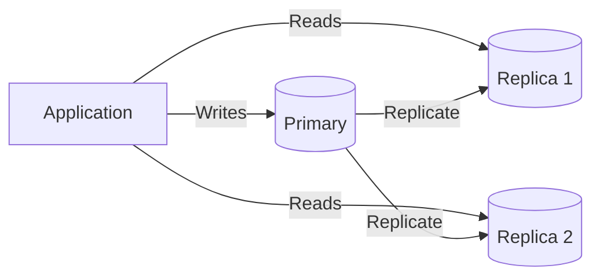

# Database Replication

## Introduction

**Replication** means copying data from one database (primary) to one or more replicas. It is used for **high availability**, **disaster recovery**, and **read scaling**.

## How It Works

- **Primary (master)**: Accepts writes and replicates them to replicas.
- **Replicas (read replicas)**: Receive a copy of the data; often used for **read-only** queries.
- **Replication lag**: Delay between a write on the primary and when it appears on a replica. Reads from replicas may be **eventually consistent**.

## Benefits

- **Read scaling**: Spread read traffic across replicas; primary handles writes.
- **Availability**: If the primary fails, a replica can be promoted (failover).
- **Geography**: Put replicas close to users for lower read latency.

<Callout variant="warning" title="Replication lag">
Reads from a replica may be stale. If a user writes then immediately reads, route the read to the primary or accept eventual consistency.
</Callout>

## Summary

<SummaryBox title="Key takeaways">
- **Replication** copies data from primary to replicas for HA and read scaling.
- Writes go to primary; reads can go to replicas (eventually consistent).
- Replication lag is a trade-off; handle it in application logic or routing.
</SummaryBox>
