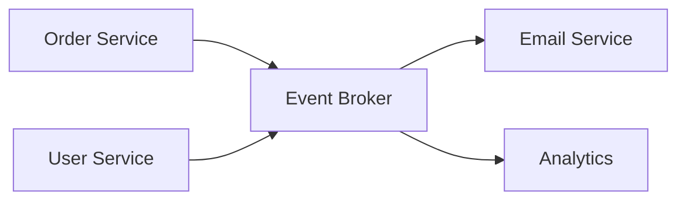

# Event-Driven Architecture

## Introduction

**Event-driven architecture (EDA)** uses **events** (something that happened) to trigger and communicate between services. Producers emit events; consumers react. Services stay **loosely coupled** and can scale independently.

## Key Concepts

- **Event**: A record that something happened (e.g. OrderPlaced, UserSignedUp). Usually immutable and timestamped.
- **Producer**: Publishes events to a **topic** or **stream**; does not know who consumes them.
- **Consumer**: Subscribes to topics and processes events (e.g. send email, update search index).
- **Event store / broker**: Holds events (e.g. Kafka, EventBridge); may retain for replay.

## Benefits

- **Loose coupling**: Producers and consumers do not call each other directly; they share only event schema.
- **Scalability**: Add more consumers for a topic; process events in parallel.
- **Resilience**: If a consumer is down, events are retained and can be replayed.
- **Audit and replay**: Event log can be replayed for new consumers or debugging.

<Callout variant="warning" title="Eventual consistency">
Event-driven systems are eventually consistent. If a consumer fails or is slow, others may see state that is not yet updated. Design for this.
</Callout>

## Summary

<SummaryBox title="Key takeaways">
- Event-driven architecture uses events to communicate between services; producers and consumers are decoupled.
- Use an event broker (e.g. Kafka) for storage, delivery, and replay.
- Design for eventual consistency and idempotent consumers.
</SummaryBox>
