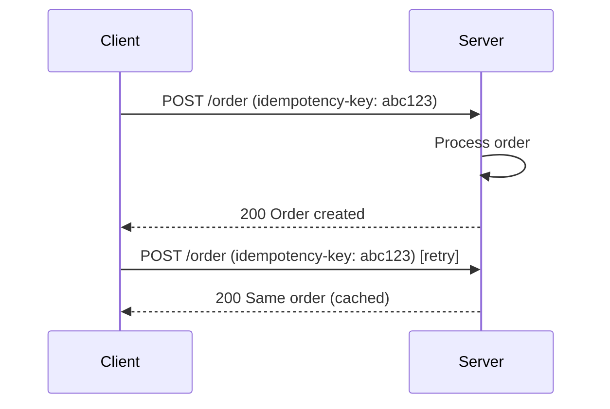

# Idempotency

## Introduction

An operation is **idempotent** if performing it **multiple times** has the same effect as performing it **once**. In distributed systems and APIs, idempotency is essential for safe retries and exactly-once semantics.

## Why It Matters

- **Retries**: Networks and services fail; clients retry. Without idempotency, a retry can double-charge, double-book, or duplicate data.
- **Exactly-once processing**: Consumers (e.g. message queue) may deliver the same message more than once. Idempotent handlers avoid duplicate side effects.

## Examples

- **GET**: Idempotent; multiple identical reads do not change state.
- **PUT with key**: Replacing a resource by key is idempotent (same key, same result).
- **DELETE by id**: Deleting the same resource twice: first deletes, second "already gone" — often treated as idempotent.
- **POST (create)**: Usually **not** idempotent; each call can create a new resource. Use **idempotency keys** to make it safe to retry.

## Idempotency Keys

Client sends a unique **idempotency key** (e.g. UUID) with a request. Server:

- First time: process request; store key with response.
- Same key again: return stored response without re-executing.

<Callout variant="tip" title="Design tip">
For critical operations (payments, orders), require an idempotency key and store key-to-result for a window (e.g. 24 hours) so retries are safe.
</Callout>

## Summary

<SummaryBox title="Key takeaways">
- **Idempotent**: doing it many times = doing it once; safe to retry.
- **GET**, **PUT**, **DELETE** are often idempotent; **POST** usually is not unless designed (e.g. with idempotency key).
- Use **idempotency keys** for create/update APIs to support safe retries.
</SummaryBox>
