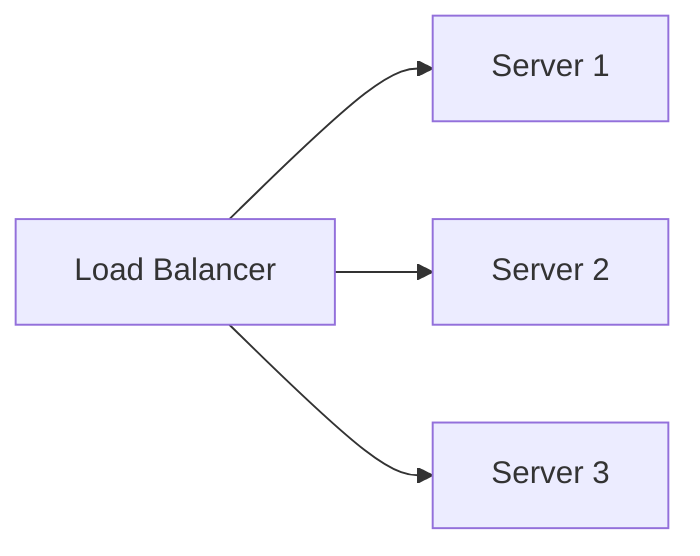

# Load Balancer Algorithms

## Introduction

Load balancers distribute requests across a pool of servers. The **algorithm** you choose affects fairness, session affinity, and how well you use each server.

## Round Robin

Each request goes to the next server in a fixed order (1, 2, 3, 1, 2, 3, ...).

- **Pros**: Simple; even distribution over time.
- **Cons**: Does not account for server load or request cost.

## Least Connections

Send the request to the server with the **fewest active connections**.

- **Pros**: Better when requests have variable duration (some long, some short).
- **Cons**: Slightly more state to track (connection counts).

## Weighted Round Robin

Assign a **weight** to each server (e.g. by CPU or capacity). Heavier servers get more requests.

- **Pros**: Handles heterogeneous servers (some big, some small).
- **Cons**: Weights must be tuned.

## IP Hash (Sticky Sessions)

Hash the client IP (or another key) to pick a server. Same client usually hits the same server.

- **Pros**: Good when session state is on the server.
- **Cons**: Uneven if some IPs generate much more traffic.

<Callout variant="tip" title="Stateless preferred">
If your app is stateless (no server-side session), use round robin or least connections. Sticky sessions make scaling harder.
</Callout>

## Summary

<SummaryBox title="Key takeaways">
- **Round robin**: Simple, even rotation.
- **Least connections**: Better for variable request duration.
- **Weighted**: For servers of different capacity.
- **IP hash**: For session affinity; prefer stateless when possible.
</SummaryBox>
