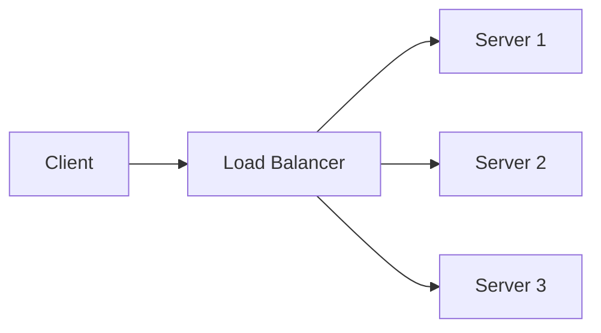

# Load Balancers

## Introduction

A **load balancer** distributes incoming traffic across multiple servers to improve availability, throughput, and latency. It is a core building block of scalable systems.

## Why Use a Load Balancer

- **High availability**: If one server fails, traffic goes to healthy ones.
- **Horizontal scaling**: Add more servers and the load balancer spreads the load.
- **Single entry point**: Clients talk to one endpoint (VIP or DNS); the balancer hides the pool of servers.

## Common Strategies

- **Round robin**: Send each request to the next server in order.
- **Least connections**: Send to the server with the fewest active connections.
- **Weighted**: Assign more traffic to more powerful or preferred servers.
- **IP hash**: Use client IP (or other key) so the same client often hits the same server (session affinity).

<Callout variant="tip" title="Stateless apps">
If your app is stateless, use round robin or least connections. Sticky sessions (IP hash) make scaling and deploys harder.
</Callout>

## Summary

<SummaryBox title="Key takeaways">
- Load balancers distribute traffic across multiple servers for scalability and availability.
- Choose a strategy (round robin, least connections, weighted, hash) based on your needs (stateless vs sticky sessions).
</SummaryBox>
