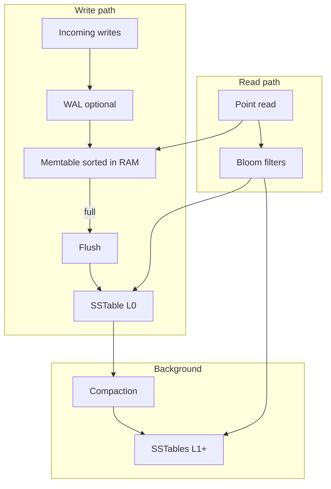

# LSM Trees vs B-Trees

**B-Trees** and **LSM trees** (log-structured merge trees) are two **fundamental on-disk structures** behind indexes and storage engines. Same goal — **durable, ordered key–value access** — but they **optimize different sides** of the read/write trade-off.

## The notebook analogy

<MetricTable
  title="Simple analogy"
  subtitle="Not exact internals — good for interviews and intuition."
  columns={['Structure', 'Mental model']}
  rows={[
    [
      'B-Tree (organized binder)',
      'Tabs and sections: you can find things fast by opening the right section. Inserting in the middle means shuffling pages around — similar to more random disk I/O.',
    ],
    [
      'LSM (append-only notebook)',
      'You only add new notes at the end, so writes feel cheap. Reads may mean checking several notebooks (memtable plus multiple SSTables); compaction periodically merges and cleans them up.',
    ],
  ]}
/>

## B-Trees: read-optimized

A **self-balancing tree** where each node holds **multiple keys** and **child pointers**. Data stays **sorted** for **O(log n)** seeks. Used by many **traditional** engines (e.g. **PostgreSQL**, **MySQL InnoDB**, **Oracle** default storage).

  

    
Strengths

    <ul className="list-inside list-disc space-y-1.5 text-sm text-muted-foreground">
      <li><strong className="text-foreground">Fast reads</strong> — O(log n) lookups; tree organized for access</li>
      <li><strong className="text-foreground">In-place updates</strong> — modify pages on disk in place</li>
      <li><strong className="text-foreground">Predictable</strong> — relatively steady latency for reads and single-row writes</li>
      <li><strong className="text-foreground">Space-efficient</strong> — no duplicate copies of the same key across levels (unlike LSM before compaction)</li>
    </ul>
  

  

    
Main downside

    

      <strong className="text-foreground">Random I/O on writes</strong> — updates and inserts can touch <strong className="text-foreground">several pages</strong> (splits, rebalancing), which is costly on spinning disks and still matters on SSDs at scale.
    

  

<Callout variant="tip" title="Link to indexing">
B-Trees are the usual **index** structure behind **`CREATE INDEX`** in Postgres/InnoDB. See **[Database Indexing](/learn/hld/database-indexing)** for index types and query patterns.
</Callout>

## LSM trees: write-optimized

**LSM** = **log-structured merge**. **Writes** land in an **in-memory** sorted buffer (**memtable**), then **flush** to **immutable sorted files** on disk (**SSTables**). **Compaction** **merges** SSTables in the **background**. Common in **Cassandra**, **RocksDB**, **LevelDB**, **InfluxDB**, and many **embedded** / **KV** stores.

  

    
Strengths

    <ul className="list-inside list-disc space-y-1.5 text-sm text-muted-foreground">
      <li><strong className="text-foreground">Fast writes</strong> — sequential append to memory, then large sequential flushes to disk</li>
      <li><strong className="text-foreground">High write throughput</strong> — great for ingest-heavy workloads</li>
      <li><strong className="text-foreground">Compression</strong> — immutable SSTables compress well</li>
      <li><strong className="text-foreground">Time-series / logs</strong> — natural fit for append-mostly data</li>
    </ul>
  

  

    
Main downsides

    <ul className="list-inside list-disc space-y-1.5 text-sm text-muted-foreground">
      <li><strong className="text-foreground">Read path</strong> may check the memtable plus several SSTables (levels)</li>
      <li><strong className="text-foreground">Write amplification</strong> — compaction rewrites data multiple times</li>
    </ul>
  

## How an LSM engine works (simplified)

<MetricTable
  title="Pipeline in four steps"
  columns={['Step', 'What happens']}
  compact
  rows={[
    [
      '1. Write to memtable',
      'In-memory sorted structure (often a skip list or balanced tree). Many engines append to a write-ahead log (WAL) first so a crash does not lose recent writes.',
    ],
    [
      '2. Flush to SSTable',
      'When the memtable is full, write sorted, immutable data to a new on-disk file (often level L0).',
    ],
    [
      '3. Compaction',
      'Background job merges SSTables: resolve duplicate keys, apply deletes (tombstones), and push data into deeper levels (size-tiered or leveled compaction).',
    ],
    [
      '4. Read path',
      'Query the memtable, then SSTables (often newest files first). Bloom filters let the engine skip whole files that cannot contain the key.',
    ],
  ]}
/>

## Head-to-head comparison

<MetricTable
  title="B-Tree vs LSM (typical characterization)"
  subtitle="Exact behavior depends on engine, tuning, and hardware."
  columns={['Aspect', 'B-Tree', 'LSM tree']}
  compact
  rows={[
    [
      'Writes',
      'Updates touch scattered pages — more random disk I/O.',
      'Append to memory, flush sorted files — mostly sequential I/O.',
    ],
    [
      'Reads',
      'Usually one root-to-leaf walk in the tree.',
      'Search memtable first, then possibly several SSTable files.',
    ],
    [
      'Space',
      'Typically one primary copy of each key in the tree.',
      'Same key can exist in multiple levels until compaction; SSTables compress well.',
    ],
    [
      'Best for',
      'Read-heavy OLTP and predictable point lookups by key.',
      'Write-heavy ingest, logs, metrics, and time-series.',
    ],
    ['Examples', 'PostgreSQL, MySQL InnoDB', 'Cassandra, RocksDB, LevelDB'],
  ]}
/>

<Callout variant="info" title="Bloom filters">
**Bloom filters** sit in front of SSTables: a **probabilistic** structure that can say “**definitely not here**” so the engine **skips** whole files. **False positives** are possible (might open a file unnecessarily); **false negatives** are not — if it says “maybe,” the file must be checked.
</Callout>

## Key takeaways

<SummaryBox title="LSM vs B-Tree — recap">
- **B-Trees** optimize for **reads** and **in-place** structure — **O(log n)** paths, **random I/O** on writes.
- **LSM trees** optimize for **writes** via **append + flush + merge** — **sequential I/O**, **compaction** to tidy levels.
- **Compaction** is the **background janitor**; it trades **CPU and write amplification** for **read efficiency** and **disk shape**.
- **Bloom filters** reduce **read amplification** by **skipping** SSTables that can’t contain a key.
- **Choose** (or recommend) based on **read/write ratio** and **latency goals** — **most classic OLTP** still maps to **B-Tree**-style engines; **ingest and wide-column / KV** stacks often use **LSM**.
- In interviews: name **trade-offs**, **one analogy**, and **one product** per side (e.g. Postgres vs Cassandra/RocksDB).
</SummaryBox>
