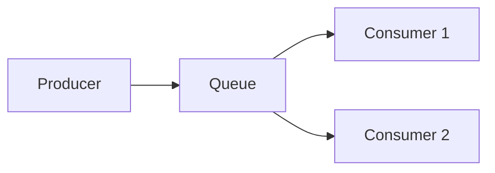

# Message Queues

## Introduction

A **message queue** decouples producers (who send messages) from consumers (who process them). Messages are stored in the queue until consumed, enabling async processing and load leveling.

## Benefits

- **Decoupling**: Producers and consumers can scale and deploy independently.
- **Reliability**: Messages persist until processed; supports retries and dead-letter queues.
- **Load leveling**: Peaks in traffic are absorbed by the queue; consumers process at their own rate.

## Common Use Cases

- Async task processing (send email, generate report).
- Event-driven architecture (events published to a queue, multiple subscribers).
- Buffering between high-throughput producers and slower consumers.

<Callout variant="tip" title="Idempotent consumers">
Design consumers to be idempotent so duplicate delivery (e.g. after retry) does not cause duplicate side effects.
</Callout>

## Summary

<SummaryBox title="Key takeaways">
- Message queues provide async, reliable communication between services.
- Use them for decoupling, reliability, and smoothing load between producers and consumers.
- Prefer idempotent consumers for at-least-once delivery semantics.
</SummaryBox>
