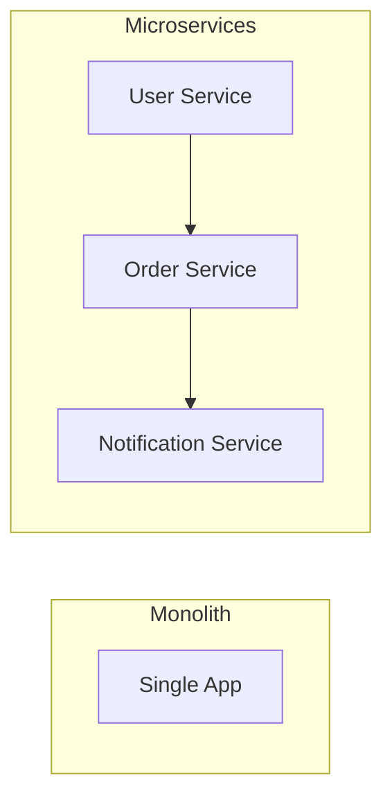

# Monolith vs Microservices

## Introduction

A **monolith** is one deployable application containing all logic. **Microservices** split that into many small, independently deployable services. The choice affects complexity, scaling, and team structure.

## Monolith

- **Single codebase and deployment**: One app; one process (or a few) that scale together.
- **Pros**: Simple to develop, deploy, and debug; transactions and consistency are straightforward.
- **Cons**: Hard to scale one part of the system; one bug can bring down everything; large teams can conflict on one repo.

## Microservices

- **Many services**: Each service owns a bounded context (e.g. users, orders, notifications); services communicate via APIs or events.
- **Pros**: Independent scaling and deployment; teams can own services; technology diversity per service.
- **Cons**: Distributed complexity (network, observability, eventual consistency); operational overhead (many deployments, service mesh, etc.).

<Callout variant="tip" title="Start simple">
Many systems start as a monolith and extract services when a clear boundary and scaling need appear. Microservices from day one often add cost without benefit.
</Callout>

## Summary

<SummaryBox title="Key takeaways">
- **Monolith**: one app; simpler to build and run; scaling and team scaling can hit limits.
- **Microservices**: many services; independent scale and deploy; more distributed complexity.
- Prefer monolith until boundaries and scaling needs are clear; then extract services.
</SummaryBox>
