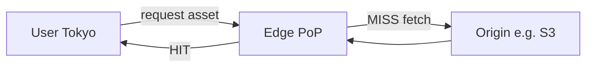

# Object Storage & CDN

**Object storage** is **durable, cheap bulk storage** for **files** (images, video, PDFs, logs) behind an **HTTP API**. A **CDN** (content delivery network) **caches** those objects **close to users** so downloads skip a long round trip to a single **origin** region. Together they are the default pattern for **global static and media delivery**.

## The warehouse and delivery analogy

<Callout variant="tip" title="Simple analogy">
**Object storage (e.g. S3):** a **huge central warehouse** — vast, inexpensive, highly durable — but often **far** from many customers.  
**CDN:** **small depots** in many cities holding **copies** of popular SKUs — a customer in Tokyo is served from **Tokyo**, not from the US headquarters.  
**Together:** **one source of truth** in object storage + **many edge caches** for **latency** and **load** off the origin.
</Callout>

<MetricTable
  title="Roles"
  columns={['Layer', 'Job']}
  rows={[
    ['Object storage', 'Authoritative blob store: PUT/GET by key, versioning, lifecycle, replication across AZs/ regions.'],
    ['CDN', 'Cache and TLS termination at edge; cache hit → fast; miss → pull from origin (often same object store or app).'],
  ]}
/>

## Object storage

**Object storage** treats data as **objects**: a **key** (often path-like), **bytes** (payload), and **metadata**. There is no POSIX directory tree on the wire — APIs are **flat namespaces** with **prefix listing**, not classic hierarchical filesystem semantics.

<MetricTable
  title="Typical characteristics"
  columns={['Theme', 'Detail']}
  compact
  rows={[
    ['Scale', 'Designed for huge namespaces and very large objects; you pay for usage rather than pre-provisioning disks.'],
    ['Durability', 'Vendors quote very high durability (e.g. many nines) via replication and erasure coding — still use backups and versioning for logical mistakes.'],
    ['Cost', 'Per-GB-month is usually far below primary OLTP storage; egress to internet often dominates spend (compare providers and CDN coupling).'],
    ['Access', 'HTTPS APIs (REST / S3-compatible SDKs); pre-signed URLs for browser uploads and downloads.'],
  ]}
/>

<MetricTable
  title="Common object storage services"
  columns={['Service', 'Provider', 'Notes']}
  compact
  rows={[
    ['Amazon S3', 'AWS', 'Widest integration surface; lifecycle, Glacier tiers, events, strong ecosystem.'],
    ['Cloud Storage', 'Google Cloud', 'Tight paths to BigQuery, GKE, ML pipelines.'],
    ['Azure Blob Storage', 'Microsoft', 'Enterprise identity and Office / M365 adjacency.'],
    ['Cloudflare R2', 'Cloudflare', 'S3-compatible API; pricing model emphasizes egress to CDN differently — read the fine print.'],
  ]}
/>

## Storage classes

Providers offer **tiers** that trade **retrieval latency**, **minimum retention**, and **cost**. Numbers below are **illustrative** — always check **current** pricing and SLA pages.

<MetricTable
  title="Example tier shape (AWS-style names vary by cloud)"
  subtitle="Illustrative relative cost and latency — not a quote."
  columns={['Class', 'Typical access', 'Rough cost vibe', 'Good for']}
  compact
  rows={[
    ['Standard (hot)', 'Milliseconds', 'Higher $/GB-month', 'User uploads, site assets, active datasets.'],
    ['Infrequent access', 'Milliseconds', 'Lower $/GB; often minimum storage duration', 'Backups, DR copies, monthly-touch data.'],
    ['Cold / archive (e.g. Glacier class)', 'Minutes to hours retrieve jobs', 'Much lower $/GB', 'Compliance archives, legal hold, rare analytics.'],
    ['Deep archive', 'Many hours', 'Lowest $/GB', 'Long-term retention accessed almost never.'],
  ]}
/>

## CDN (content delivery network)

A **CDN** runs **PoPs** (points of presence) worldwide. Clients resolve to a **nearby edge**; if the object is **cached**, response is **fast** and origin load drops. On **miss**, the edge **fetches** from **origin** (object storage, load balancer, or app), then **caches** per **TTL** or **cache policy**.

<MetricTable
  title="Popular CDN providers (high level)"
  columns={['Provider', 'Notes']}
  compact
  rows={[
    ['Cloudflare', 'Large free tier for many sites; DDoS, WAF, Workers; integrates with R2 and DNS.'],
    ['Amazon CloudFront', 'Native S3 and ALB origins; Lambda@Edge / CloudFront Functions for header and auth tweaks.'],
    ['Fastly', 'Strong purge and configuration APIs; edge logic; common for media and commerce.'],
    ['Akamai', 'Very large enterprise footprint; broadcast and large-event streaming experience.'],
  ]}
/>

Latency improvement is **path-dependent**: a **cache hit** at edge is often **tens of ms** better than **cross-ocean** origin — **miss** still pays **origin + fill**.

## Object storage + CDN architecture

<MetricTable
  title="Typical image / video pipeline"
  columns={['Step', 'Flow']}
  compact
  rows={[
    ['1. Upload', 'Client or app uploads to API → server validates → PUT to private bucket (pre-signed URL upload is common).'],
    ['2. Process', 'S3 event / queue triggers workers → resize, transcode, virus scan → write derivatives (thumbnails, HLS segments).'],
    ['3. Serve', 'Public or signed URLs point at CDN hostname; CDN caches by path; miss pulls from bucket or image optimizer origin.'],
    ['4. Invalidate / version', 'On replace, purge CDN paths or ship a new object key (e.g. avatar-v3.jpg) to bust caches cheaply.'],
  ]}
/>

<Callout variant="info" title="URL strategy">
Prefer **immutable** object names with a **content hash** or **version** in the path (`/avatars/user-123/a8f3….webp`) so the CDN can cache **forever** and you avoid **purge storms**. When you must purge, use **provider APIs** or **cache-tags** where available.
</Callout>

## When to use what

<MetricTable
  title="Object storage vs CDN (complementary, not competing)"
  columns={['Use object storage for…', 'Add a CDN when…']}
  compact
  rows={[
    ['User-generated uploads, backups, archives, data lake landing zones, static site buckets', 'You serve those bytes to many geographic users or need edge TLS and DDoS absorption'],
    ['Large immutable blobs and logs', 'You need predictable download performance worldwide'],
    ['Source masters for video (mezzanine) and documents', 'You stream or download frequently — edge caches and segmented protocols (HLS/DASH) matter'],
  ]}
/>

## Key takeaways

<SummaryBox title="Object storage & CDN — recap">
- **Object storage** is **cheap, durable, API-addressable** file storage at **huge** scale — default for **uploads**, **assets**, and **archives**.
- **CDNs** **cache** at **edge** to cut **latency**, **origin** load, and often add **security** (WAF, bot, TLS).
- Pick **storage class** from **access pattern** and **retrieval time** tolerance — **cold** tiers save money when reads are rare.
- **S3 (or equivalent) + CDN** is the standard **origin + delivery** split; **versioned** or **hashed** URLs simplify **cache** behavior.
- **Invalidation** is operationally costly — prefer **immutable** assets; use **purge** when you must.
- In interviews: walk **upload → process → publish URL → CDN hit/miss → invalidation** and mention **egress cost** and **PII** in URLs or logs.
</SummaryBox>
