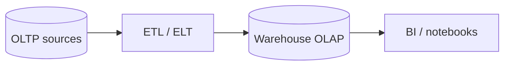

# OLTP vs OLAP

Two **different workload patterns**: **OLTP** powers day-to-day **transactions**; **OLAP** powers **analytics** on large history. Most serious products use **both**, connected by **pipelines**.

## The store analogy

<MetricTable
  title="Cash register vs accountant’s desk"
  subtitle="Same business — different job: speed at the counter vs insight from the books."
  columns={['Pattern', 'Analogy', 'What it is']}
  rows={[
    ['OLTP', 'Cash register — many small, fast sales; stock updates; receipts', 'Online **Transaction** Processing: lots of short reads/writes, strong consistency per operation'],
    ['OLAP', 'Month-end — trends, bestsellers, margins across millions of lines', 'Online **Analytical** Processing: heavy scans, aggregates, few concurrent heavy queries'],
  ]}
/>

<MetricTable
  title="One-line definitions"
  columns={['Type', 'Optimized for']}
  compact
  rows={[
    ['OLTP', 'Many concurrent **small** transactions — orders, profiles, inventory rows'],
    ['OLAP', '**Complex** queries over **large** historical datasets — BI, dashboards, ML features'],
  ]}
/>

## Key differences

<MetricTable
  title="OLTP vs OLAP — comparison"
  columns={['Aspect', 'OLTP', 'OLAP']}
  compact
  rows={[
    ['Purpose', 'Run the business (operational)', 'Understand the business (reporting / science)'],
    ['Typical queries', 'Point lookups, short writes, simple joins', 'Aggregations, GROUP BY, windows, scans over huge ranges'],
    ['Data focus', 'Current **state** (latest truth)', '**Historical** facts + dimensions over time'],
    ['Writes', 'INSERT / UPDATE / DELETE as part of normal work', 'Mostly **loads** (batch / micro-batch); reads dominate'],
    ['Concurrency', 'Many **simultaneous** small requests', 'Fewer **heavy** jobs (but each is expensive)'],
    ['Latency target', 'Milliseconds for user-facing paths', 'Seconds to minutes (or more) acceptable'],
    ['Schema style', 'Often **normalized** (3NF) for writes', 'Often **denormalized** (star / snowflake) for read analytics'],
    ['Storage layout (typical)', '**Row**-oriented', '**Column**-oriented for scans'],
  ]}
/>

## OLTP characteristics

  
What defines OLTP systems

  <ul className="list-inside list-disc space-y-2 text-sm text-muted-foreground">
    <li><strong className="text-foreground">High concurrency</strong> — many users, small units of work</li>
    <li><strong className="text-foreground">ACID</strong> — correctness for money, inventory, identity</li>
    <li><strong className="text-foreground">Normalized schema</strong> — less duplication, safer updates</li>
    <li><strong className="text-foreground">Row-oriented storage</strong> — fetch/update whole business rows efficiently</li>
  </ul>

<MetricTable
  title="Common OLTP engines (examples)"
  columns={['Engine', 'Notes']}
  compact
  rows={[
    ['PostgreSQL, MySQL, MariaDB', 'Default OLTP workhorses for apps'],
    ['Oracle, SQL Server', 'Enterprise OLTP + adjacent features'],
    ['CockroachDB, Spanner-class', 'Distributed SQL still serving transactional shapes'],
  ]}
/>

## OLAP characteristics

  
What defines OLAP / warehouse workloads

  <ul className="list-inside list-disc space-y-2 text-sm text-muted-foreground">
    <li><strong className="text-foreground">Complex queries</strong> — GROUP BY, CUBE, window functions over huge fact tables</li>
    <li><strong className="text-foreground">Columnar storage</strong> — read only needed columns for aggregates</li>
    <li><strong className="text-foreground">Denormalized models</strong> — star / snowflake for analyst-friendly joins</li>
    <li><strong className="text-foreground">Batch / scheduled loads</strong> — ETL / ELT from operational systems</li>
  </ul>

<MetricTable
  title="Common OLAP / warehouse systems (examples)"
  columns={['System', 'Notes']}
  compact
  rows={[
    ['Snowflake, BigQuery, Redshift', 'Cloud warehouses — separation of storage/compute varies'],
    ['ClickHouse, Druid', 'Columnar / real-time analytics engines'],
    ['Databricks, Spark SQL', 'Lakehouse / large-scale SQL over data lakes'],
  ]}
/>

## Data warehouse architecture (typical flow)

<MetricTable
  title="Pipeline stages"
  columns={['Step', 'Role']}
  compact
  rows={[
    ['1. OLTP databases', 'Systems of record — orders, CRM, billing (live operations)'],
    ['2. Extract–transform–load', 'Copy, clean, conform; CDC or batch jobs'],
    ['3. Data warehouse / lake', 'Historical facts + dimensions; OLAP-optimized storage'],
    ['4. BI & analytics', 'Tableau, Looker, Mode, internal SQL, feature stores'],
  ]}
/>

<Callout variant="warning" title="Don’t run heavy analytics on production OLTP">
Ad-hoc **big scans** on the primary transactional DB compete with **checkout and APIs**, risk **locks**, and skew **backups**. Offload to **replicas** (light reporting only) or, better, a **warehouse** path built for aggregates.
</Callout>

## Key takeaways

<SummaryBox title="OLTP vs OLAP — recap">
- **OLTP** = **many small** transactions, **ACID**, **normalized**, **row** stores — **run** the product.
- **OLAP** = **few heavy** analytical queries, **columnar**, **denormalized** models — **understand** the product.
- **Most architectures use both**: operational DB for truth; **warehouse** for reporting and data science.
- **ETL/ELT** (or **CDC**) moves data from OLTP-shaped systems into OLAP-shaped stores.
- Keep **analytics off the critical OLTP path** unless you have a dedicated, capacity-planned path.
</SummaryBox>
