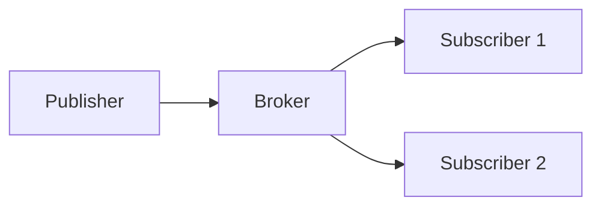

# Pub/Sub Pattern

## Introduction

**Publish/Subscribe (Pub/Sub)** is a messaging pattern where **publishers** send messages to a **topic** without knowing who will consume them. **Subscribers** receive messages for topics they subscribe to. Publishers and subscribers are **decoupled**.

## How It Works

- **Publisher**: Publishes a message to a topic (e.g. order.created).
- **Broker**: Message broker (e.g. Kafka, RabbitMQ) holds the topic and delivers to subscribers.
- **Subscriber**: Subscribes to one or more topics and receives messages.

## Benefits

- **Decoupling**: Publishers do not know subscribers; new subscribers can be added without changing publishers.
- **Scale**: Multiple subscribers can process in parallel; broker can persist and replay.
- **Async**: Publishers continue without waiting for processing.

## Summary

<SummaryBox title="Key takeaways">
- **Pub/Sub**: Publishers send to topics; subscribers receive messages for their topics.
- Decouples producers and consumers; supports fan-out and async processing.
- Use when you need event-driven, decoupled architecture.
</SummaryBox>
