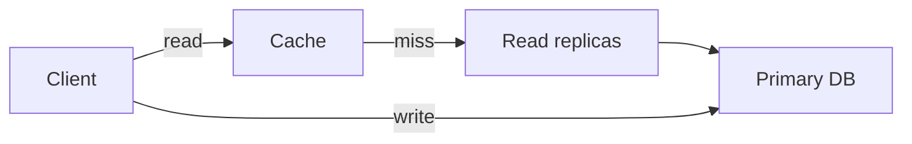
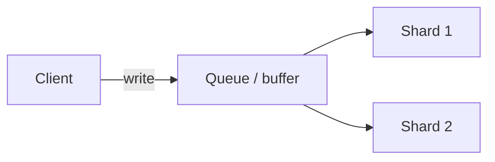

# Read vs Write Patterns

Your **read/write ratio** (and **latency** goals) steer **caching**, **replication**, **sharding**, and **storage** choices. Mis-match the pattern and you’ll **over-build writes** on a read-mostly product — or **melt the database** on ingest-heavy telemetry.

## The library vs newspaper analogy

<Callout variant="tip" title="Simple analogy">
**Read-heavy (library):** Books are written once and read many times. You optimize for **finding and reading** — categories, indexes, copies on shelves.  
**Write-heavy (newspaper):** Stories keep arriving; you must **record fast**. Readers can wait a bit for today’s edition to be **sorted and laid out**.  
Your **data path** should mirror the **dominant** access pattern.
</Callout>

<MetricTable
  title="Pattern → priorities"
  subtitle="Illustrative — real systems mix both; measure your traffic."
  columns={['Pattern', 'Mental model']}
  rows={[
    [
      'Read-heavy',
      'Like a library: optimize discovery and retrieval — indexes, caches, replicas, denormalized read models. Writes are rare compared to reads.',
    ],
    [
      'Write-heavy',
      'Like a newsroom: ingest first — sequential logs, batching, queues, sharding by key or time. Reads can be slower or async.',
    ],
  ]}
/>

## Read-heavy workloads

Often **many more reads than writes** (people commonly cite **10:1** or higher as “read-heavy” — it’s a rule of thumb, not a law). Examples: **social feeds**, **product catalogs**, **content sites**, **profile views**.

<MetricTable
  title="Optimization strategies (read-heavy)"
  columns={['Strategy', 'What it does', 'Why it helps']}
  compact
  rows={[
    [
      'Caching',
      'Keep hot data in memory (Redis, Memcached, in-process).',
      'Avoids repeated disk and DB work; can serve far more read QPS from RAM than from primary DB alone.',
    ],
    [
      'Read replicas',
      'Copy data to read-only database instances; route SELECTs to replicas.',
      'Scales read throughput horizontally; primary focuses on writes.',
    ],
    [
      'Denormalization',
      'Store redundant fields or pre-joined shapes for hot queries.',
      'Fewer JOINs at read time; trade storage and update complexity for faster reads.',
    ],
    [
      'CDN',
      'Cache static or cacheable responses at edge PoPs worldwide.',
      'Lower latency for global users; origin sees fewer repeat requests.',
    ],
  ]}
/>

### Read-optimized flow (conceptual)

Many reads **hit cache**; cache **misses** go to **replicas**; **writes** still land on the **primary** (simplified).

## Write-heavy workloads

**Frequent writes** relative to reads — ratios like **below 3:1** reads:writes, or **write-dominated** traffic. Examples: **logging**, **IoT telemetry**, **analytics events**, **high-volume messaging**, **audit streams**.

<MetricTable
  title="Optimization strategies (write-heavy)"
  columns={['Strategy', 'What it does', 'Why it helps']}
  compact
  rows={[
    [
      'Write-behind / buffering',
      'Buffer in memory or a queue, flush to DB in batches.',
      'Amortizes disk I/O; fewer round-trips to the database (watch durability windows).',
    ],
    [
      'Append-only logs',
      'Append to sequential files or log segments instead of random in-place updates.',
      'Sequential I/O matches disks and many LSM-style stores; great for event streams.',
    ],
    [
      'Sharding',
      'Partition data across many nodes by key, hash, or time range.',
      'Spreads write load; each shard handles a slice of keys (cross-shard queries get harder).',
    ],
    [
      'Async processing',
      'Acknowledge the write quickly; process downstream via queue or stream.',
      'Stable API latency under spikes; consumers scale independently.',
    ],
  ]}
/>

### Write-optimized flow (conceptual)

**Distributed writes** spread across **shards**; a **queue** absorbs bursts and enables **batching**.

## Read/write ratio examples

Ratios are **illustrative** — real products vary by feature and time of day.

<ReadWriteExamplesTable
  title="Rough R:W flavor (examples)"
  subtitle="Order-of-magnitude intuition for interviews — always confirm with data. Notes column: horizontal bars (sky = read weight, amber = write weight) plus a short caption."
  rows={[
    {
      system: 'Twitter / X timeline (hot tweets)',
      ratioLabel: '1000 : 1 (or higher)',
      reads: 1000,
      writes: 1,
      caption: 'Popular tweets read vastly more than they are written.',
    },
    {
      system: 'E-commerce catalog',
      ratioLabel: '100 : 1',
      reads: 100,
      writes: 1,
      caption: 'Many product views per price or stock update.',
    },
    {
      system: 'Banking (typical retail)',
      ratioLabel: '10 : 1',
      reads: 10,
      writes: 1,
      caption: 'Balance checks and history vs payments and transfers.',
    },
    {
      system: 'Chat / messaging',
      ratioLabel: '3 : 1',
      reads: 3,
      writes: 1,
      caption: 'Both send and read; still often read-skewed in aggregate.',
    },
    {
      system: 'IoT sensor ingest',
      ratioLabel: '1 : 100',
      reads: 1,
      writes: 100,
      caption: 'Constant telemetry; occasional dashboards or queries.',
    },
    {
      system: 'Centralized logging',
      ratioLabel: '1 : 1000',
      reads: 1,
      writes: 1000,
      caption: 'Huge append volume; analytical reads are rarer or batched.',
    },
  ]}
/>

## Balancing reads and writes

<MetricTable
  title="Techniques vs trade-offs"
  subtitle="Strong = big lever for that side; — = not the main benefit."
  columns={['Technique', 'Helps reads', 'Helps writes', 'Trade-off']}
  compact
  rows={[
    ['Caching', 'Strong', '—', 'Invalidation, staleness, cold-cache behavior.'],
    ['Read replicas', 'Strong', '—', 'Replication lag; not a substitute for write scaling.'],
    ['Sharding', 'Some', 'Strong', 'Cross-shard queries and transactions get harder.'],
    ['Denormalization', 'Strong', 'Hurts updates', 'Duplication; keeping copies consistent on writes.'],
    ['Async / queued writes', '—', 'Strong', 'Eventual consistency; harder error handling for callers.'],
  ]}
/>

## Interview-style prompts

<MetricTable
  title="Connect pattern to design"
  columns={['Prompt', 'Read/write read', 'Direction']}
  compact
  rows={[
    [
      'Design a URL shortener',
      'Heavily read-skewed: short links created once, resolved constantly.',
      'Aggressive caching, read replicas or edge cache, minimal write path on primary.',
    ],
    [
      'Design a logging / observability pipeline',
      'Heavily write-skewed: huge append volume; queries are fewer or batch analytics.',
      'Append-friendly storage, time or tenant sharding, async indexing for search.',
    ],
    [
      'Design a messaging app',
      'Mixed: sends and reads both matter; often write pressure plus fan-out reads.',
      'Write-optimized stores or partitions per thread; caching for hot threads and presence.',
    ],
  ]}
/>

## Key takeaways

<SummaryBox title="Read vs write patterns — recap">
- **Know the ratio** (and **peaks**) — it drives caching, replicas, sharding, and storage engine choices.
- **Read-heavy:** cache aggressively, use **read replicas** and **CDNs**, consider **denormalized** read models.
- **Write-heavy:** **batch** and **buffer**, prefer **append** and **partition** writes, use **queues** for back pressure.
- Many **consumer web** surfaces are **read-skewed** (often **10:1** to **1000:1** for hot content) — but **verify** for your feature.
- In interviews, ask: **“What’s the expected read/write ratio and burst behavior?”**
- **Optimize the common path**; **degrade gracefully** on edge cases (slow replica, cache miss storm, write spike).
</SummaryBox>
