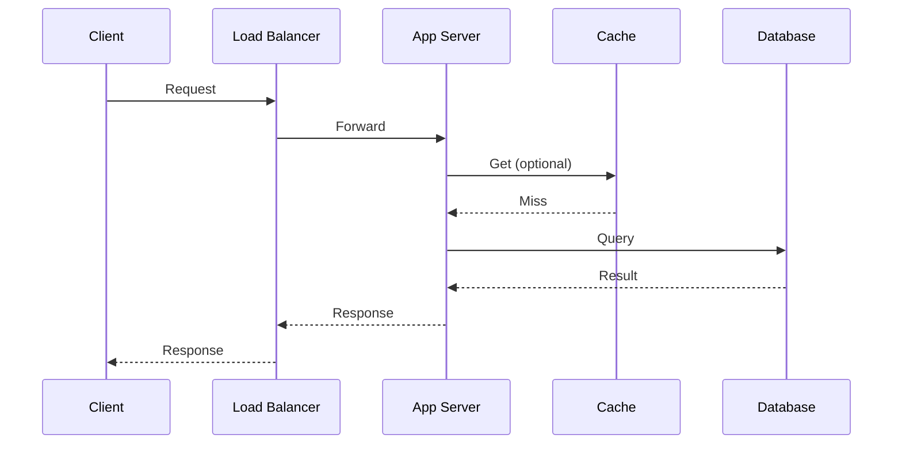

# Request Lifecycle

What happens from the moment you type a URL to seeing the page? Below, **narrative sections** walk through each phase; **tables** are used only where comparing rows and columns actually helps (durations, HTTP versions, optimizations).

## The mail delivery analogy

Sending a web request is a lot like mailing a letter: compose a message, resolve an address, route through the network, and get a delivery back.

<MetricTable
  title="Letter vs web request"
  subtitle="Same pattern: compose → resolve address → carry over network → deliver."
  columns={['Step', 'Mail analogy', 'Web request']}
  rows={[
    ['Compose', 'Write the letter', 'Build the HTTP request (method, URL, headers, optional body)'],
    ['Address', 'Look up street / ZIP', 'DNS: hostname → IP address'],
    ['Transit', 'Postal trucks & sorting', 'TCP/IP routing, TLS, proxies, load balancers'],
    ['Delivery', 'Letter reaches mailbox', 'Response arrives; browser parses and renders'],
  ]}
/>

## Complete request flow

When you type `https://example.com/api/users` and press Enter, the browser goes through phases like these (order and timing vary; HTTPS assumes TLS).

### 1. DNS resolution

**Goal:** turn `example.com` into an IP such as `93.184.216.34`. **Typical:** ~1–100 ms if not cached.

**What happens:**

1. Check **browser DNS cache**
2. Check **OS cache** (e.g. hosts file, resolver cache)
3. Ask the **recursive resolver** (often your ISP or `1.1.1.1` / `8.8.8.8`)
4. Resolver walks **root → TLD (.com) → authoritative** name servers if needed

**Sketch:**

```
Browser → cache hit? → else resolver → authoritative → IP
```

### 2. TCP connection

**Goal:** reliable byte stream between client and server. **Typical:** ~10–100 ms depending on RTT.

**What happens (three-way handshake):**

1. Client **SYN**
2. Server **SYN-ACK**
3. Client **ACK** → connection established

**Sketch:**

```
Client —SYN→ Server
Client ←SYN-ACK— Server
Client —ACK→ Server
```

### 3. TLS handshake (HTTPS)

**Goal:** encrypt the channel and verify the server. **Typical:** ~30–150 ms (extra round trips; faster with session resumption).

**What happens:**

1. **Client Hello** — cipher suites, random, extensions (e.g. SNI)
2. **Server Hello** — chosen parameters + **certificate chain**
3. Client **validates** cert against trusted CAs
4. **Key exchange** → shared session keys
5. Further data is **encrypted**

**Sketch:**

```
Client Hello  ↔  Server Hello + certificate
       →  key exchange  →  🔒 encrypted application data
```

### 4. HTTP request

**Goal:** send the actual application request. **Typical:** small compared to TLS/RTT unless the body is huge.

**What happens:**

1. **Method** — GET, POST, PUT, PATCH, DELETE, …
2. **Headers** — `Host`, `User-Agent`, `Accept`, cookies, auth, `Content-Type`, …
3. **Body** — optional (e.g. JSON for POST/PUT)

```http
GET /api/users HTTP/1.1
Host: example.com
Authorization: Bearer eyJhbGc...
Accept: application/json
Cookie: session=abc123
```

### 5. Server processing

**Goal:** produce a response. **Typical:** highly variable (often the **largest** slice of latency).

**What happens:**

1. **Load balancer** picks a healthy backend
2. **Edge / web server** (e.g. nginx) terminates TLS or forwards
3. **Application** runs your logic
4. **Cache** (e.g. Redis) and **database** reads/writes as needed
5. Response is **serialized** (JSON, HTML, etc.)

**Sketch:**

```
Load balancer → web tier → app → cache? → database? → response
```

### 6. HTTP response

**Goal:** return status, headers, and body. **Transfer time** grows with payload size and bandwidth.

**What happens:**

1. **Status line** — `200`, `404`, `500`, …
2. **Headers** — `Content-Type`, `Cache-Control`, `Set-Cookie`, `Content-Encoding`, …
3. **Body** — HTML, JSON, bytes for downloads, …
4. May be **compressed** (gzip, Brotli)

```http
HTTP/1.1 200 OK
Content-Type: application/json
Cache-Control: max-age=3600
Content-Encoding: gzip

{"users":[{"id":1,"name":"Alice"}]}
```

### 7. Browser rendering

**Goal:** turn bytes into pixels. **Typical:** milliseconds to seconds for heavy pages.

**What happens:**

1. Parse **HTML** → DOM
2. Parse **CSS** → CSSOM
3. Run **JavaScript** (may change DOM)
4. **Layout** — geometry
5. **Paint / composite** — draw to screen

**Sketch:**

```
HTML → DOM  +  CSS → CSSOM  →  render tree  →  layout  →  paint
```

## Latency at each step

Illustrative **single-request** breakdown (not a guarantee — CDN, HTTP/2, caching, and geography change everything):

<MetricTable
  title="Typical request timeline (illustrative ~200 ms total)"
  subtitle="Rough proportions: server work often dominates; network and TLS matter on cold connections."
  columns={['Phase', 'Typical duration', 'Notes']}
  rows={[
    ['DNS lookup', '1–100 ms', 'Often cached after first visit'],
    ['TCP connect', '10–100 ms', 'One RTT-ish per direction; reuse cuts cost'],
    ['TLS handshake', '30–150 ms', 'Session resumption and TLS 1.3 improve this'],
    ['Request send', '5–50 ms', 'Small unless upload is large'],
    ['Server processing', '10–1000+ ms', 'Usually where you optimize (DB, cache, code)'],
    ['Response transfer', '10–500+ ms', 'Depends on size, compression, bandwidth'],
    ['Parse & render', '10–1000+ ms', 'DOM/CSS/JS cost; lazy loading helps'],
  ]}
/>

<Callout variant="tip" title="Where to optimize first">
**Server processing** is often the biggest lever **you** control. Pair that with **DNS caching**, **connection reuse** (keep-alive), **TLS resumption**, and **CDNs** for static or cacheable responses.
</Callout>

## Key optimizations (by layer)

Use this as a **checklist**, not a todo list for every project — measure first.

<MetricTable
  title="Optimizations by layer"
  subtitle="Pick what matches your bottleneck (tracing will tell you)."
  columns={['Layer', 'Examples']}
  accentLastColumn
  rows={[
    ['DNS', 'dns-prefetch / preconnect; fewer sharded domains; sane TTLs'],
    ['TCP / TLS', 'Keep-alive; HTTP/2 or HTTP/3; TLS session resumption; OCSP stapling'],
    ['Request', 'Smaller payloads; gzip/Brotli; HTTP/2 multiplexing; avoid unnecessary redirects'],
    ['Server', 'Redis or in-memory cache; DB indexes; async work off the hot path; autoscaling'],
    ['Response', 'Chunked or streaming responses; edge rendering; strong cache headers where safe'],
    ['Browser', 'Lazy load media; code splitting; image formats (AVIF/WebP); defer non-critical JS'],
  ]}
/>

## HTTP/1.1 vs HTTP/2 vs HTTP/3

<MetricTable
  title="Protocol comparison (interview-friendly)"
  subtitle="HTTP/2 multiplexes over one TCP connection; HTTP/3 moves to QUIC over UDP to reduce head-of-line blocking at the transport layer. Server push exists in HTTP/2 but is uncommon in practice."
  columns={['Feature', 'HTTP/1.1', 'HTTP/2', 'HTTP/3']}
  compact
  rows={[
    ['Connections', 'Many (browsers cap per host, e.g. ~6)', 'Single connection (multiplexed streams)', 'Single QUIC connection (streams)'],
    ['Head-of-line blocking', 'Yes (request queue)', 'TCP-level HOL still possible', 'Reduced (QUIC stream independence)'],
    ['Header compression', 'No', 'HPACK', 'QPACK'],
    ['Server push', 'No', 'Yes (rarely used)', 'No'],
    ['Transport', 'TCP', 'TCP', 'QUIC (UDP)'],
  ]}
/>

## System view (high level)



## Interactive: request lifecycle simulator

<RequestLifecycleSimulator />

## Key takeaways

<SummaryBox title="Interview-style recap">
- **Seven big ideas:** DNS → TCP → TLS → HTTP request → server work → HTTP response → render.
- **DNS** maps names to IPs; **caching** and **fewer domains** reduce lookups.
- **TCP + TLS** add latency on new connections; **reuse** and modern protocols help.
- **Server + database** usually dominate **your** p99; **cache** and **indexes** matter.
- **HTTP/2** multiplexes on **TCP**; **HTTP/3** uses **QUIC** to improve lossy / mobile networks.
- **Trace a request** layer by layer and name **one optimization** per hop.
</SummaryBox>
