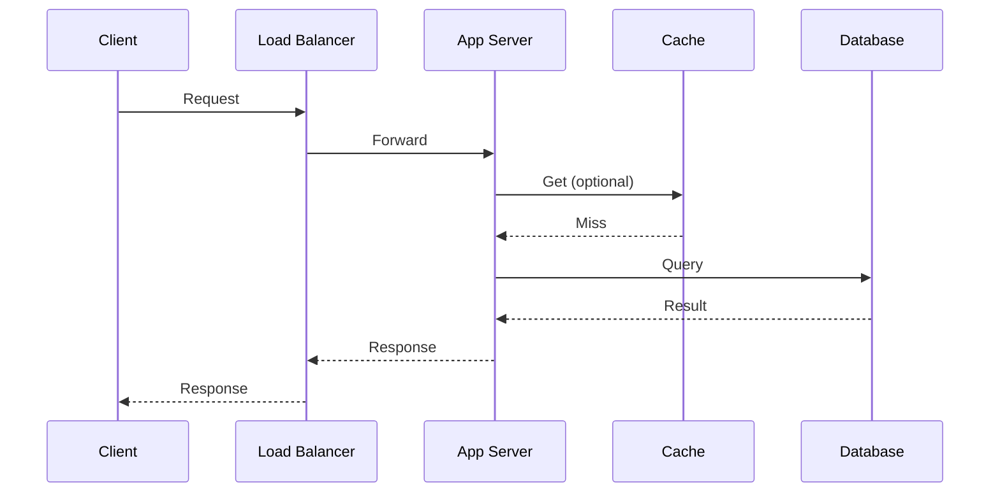

# Request Lifecycle

## Introduction

Understanding the **request lifecycle** helps you see where latency and failures can occur. A typical web request passes through several layers before returning a response.

## End-to-End Flow

1. **Client** sends HTTP request (e.g. browser, mobile app).
2. **DNS**: Domain is resolved to an IP (unless cached).
3. **Load balancer**: Request is forwarded to one of many app servers.
4. **App server**: Business logic runs; may call **cache**, **database**, or **other services**.
5. **Response** is sent back through the same path.

## Where Time Is Spent

- **Network**: Round-trip time (RTT) between client and server; can be reduced with CDN or edge.
- **Application**: CPU and I/O in your code; optimize hot paths and avoid N+1 queries.
- **Database**: Query time and connection pool; use indexes, caching, and read replicas.
- **External APIs**: Latency of third-party calls; use timeouts, circuit breakers, and async where possible.

<Callout variant="tip" title="Measure first">
Use distributed tracing and metrics (e.g. p99 latency per layer) to find the real bottleneck before optimizing.
</Callout>

## Summary

<SummaryBox title="Key takeaways">
- Request flows: Client to LB to App to Cache/DB and back.
- Latency can come from network, app logic, database, or external APIs.
- Measure with tracing and metrics; then optimize the bottleneck.
</SummaryBox>
