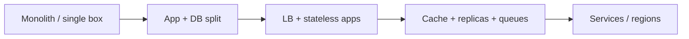

# The Scaling Mindset

How to think about systems that grow from **hundreds** to **hundreds of millions** of users. Below, **stories and stages** carry the narrative; **tables** appear only where rows and columns really help (principles, bottlenecks, trade-offs).

## The restaurant analogy

Each **order of magnitude** of demand usually forces **new structure** — not just “working harder.”

<MetricTable
  title="Restaurant traffic vs software scale"
  subtitle="Rough analogy: specialization, duplication, and supply chains mirror scale-out, caches, and regional deployment."
  columns={['Rough scale', 'Restaurant', 'Systems takeaway']}
  rows={[
    ['~10/day', 'You cook, serve, and clean alone', 'One process, one machine — fine to validate the idea'],
    ['~100/day', 'Dedicated waiter + cook; roles split', 'Separate concerns (e.g. app vs DB); first taste of boundaries'],
    ['~1K/day', 'Multiple cooks, bigger kitchen, reservations', 'Parallel workers, queues, predictable load (caching, pooling)'],
    ['~10K+/day', 'More locations, central kitchen & supply', 'Multiple regions, shared services, data placement matters'],
  ]}
/>

**Remember:** user counts are **illustrative**. A chat app at 10K users can stress the DB more than a static site at 1M. Always tie scale to **metrics** (RPS, p99, storage growth).

## Evolution of architecture at scale

These phases often appear **in order**, but teams **skip back** (e.g. simplify after over-splitting) or **combine** steps (managed DB + LB on day one).

### 1. Single server (~0 – 1K users, illustrative)

**Shape:** browser → one host running **app + database** (or app with embedded store).

**Good for:** speed of iteration, tiny teams, unknown product shape.

**Watch for:** no redundancy, disk and CPU ceilings, risky deploys.

```
Users ──► [ App + DB ]
```

### 2. Separate database (~1K – 100K)

**Shape:** app tier talks to a **dedicated database** over the network.

**Why it helps:** tune CPU/RAM independently; backups and failover focus on data; you can add **Redis** between app and DB without rewriting the world.

**Watch for:** DB becomes the magnet for load; **N+1** queries and missing **indexes** hurt early.

```
Users ──► App server ──► Database
              │
              └──► Redis (sessions / hot reads) — optional but common
```

### 3. Load balancing (~100K – 1M)

**Shape:** **multiple app instances** behind a **load balancer**; one primary DB (often plus cache).

**Requirements:** **Stateless** app servers — session in **Redis**, uploads in **object storage**, no “sticky” reliance on local disk.

**Watch for:** DB **read** and **write** ceilings; connection pool exhaustion.

```
Users ──► Load balancer ──► App₁  App₂  App₃
                              │
                              └──► Primary DB
```

### 4. Database scaling & async (~1M – 10M)

**Shape:** **read replicas**, heavier **caching**, **message queues** for work that doesn’t need to complete inside the HTTP request.

**Typical moves:** CQRS-style read paths, **sharding** when single-primary writes or size break limits, **async** notifications and analytics.

**Watch for:** **replication lag**, consistency models, and operational complexity.

```
                    ┌──► Read replica 1
LB ──► Apps ──► Cache ──┼──► Read replica 2
                    └──► Primary (writes)
Queues ◄──► workers (async jobs)
```

### 5. Service boundaries (~10M+ and/or large orgs)

**Shape:** **API gateway** (or BFF) routing to **services** with **separate deployables** and often **separate data stores** per bounded context.

**Why teams do it:** independent scaling and ownership, clearer blast radius **when** domains are well drawn.

**Caution:** **microservices** are not a starting default — they need **observability**, **contracts**, and **culture**. Many successful products stay **modular monoliths** longer than you’d think.

```
Users ──► API gateway ──► Orders ── Payments ── Inventory ── Search …
                              │        │           │
                              ▼        ▼           ▼
                            DB       DB          DB / index
```

## Mental model: progression



## Interactive: explore by scale

<ScalingMindsetExplorer />

## Key scaling principles

<MetricTable
  title="Principles that keep scaling sane"
  subtitle="Apply in order: find the real bottleneck, then pick the smallest change that buys headroom."
  columns={['Principle', 'What it means', 'Example']}
  rows={[
    ['Find the bottleneck', 'One dominant limiter at a time; fix it, re-measure', 'CPU hot on app → scale out; DB slow → cache or replicas'],
    ['Stateless services', 'Any instance can serve any request; state lives outside the box', 'JWT or Redis sessions; files in S3 — not local disk'],
    ['Cache aggressively', 'Avoid repeating expensive work', 'CDN for static; Redis for hot keys; memoize inside reason'],
    ['Async when possible', 'If the user doesn’t need the result in-line, decouple', 'Emails, search indexing, analytics via queues'],
    ['Partition data', 'When one DB isn’t enough, split by key or region', 'Shard by user_id; multi-region for compliance / latency'],
    ['Measure, don’t guess', 'Profile, trace, and watch percentiles', 'Don’t rewrite the 0.1% path before fixing p99 DB time'],
  ]}
/>

## Common bottlenecks & responses

<MetricTable
  title="Pain → signals → levers"
  subtitle="Symptoms are hints — confirm with metrics and traces before big rewrites."
  columns={['Area', 'Typical signals', 'Directions to try']}
  compact
  accentLastColumn
  rows={[
    ['App CPU saturated', 'High CPU, rising latency, timeouts', 'Horizontal scale + LB; profile hot paths; consider cache'],
    ['Database reads', 'High DB CPU, slow queries, read timeouts', 'Indexes; read replicas; application cache; smaller SELECTs'],
    ['Database writes', 'Write queue growth, replication lag', 'Sharding; async writes; batching; stronger write path design'],
    ['Network / egress', 'Bandwidth pegged, timeouts, retries', 'CDN; compression; smaller payloads; edge where it fits'],
    ['External APIs', '429s, variable latency, cascade failures', 'Cache responses; circuit breaker; backoff; batching'],
  ]}
/>

## The 10× rule

Design so the **next ~10×** is plausible without a full rewrite — but **don’t** build for hypothetical 100× on day one.

<MetricTable
  title="Under vs right vs over (mental model)"
  subtitle="Interview tip: narrate evolution — what you’d run at 1K, what you’d add at 100K, what breaks at 1M."
  columns={['Stance', 'What it looks like', 'Risk']}
  rows={[
    ['Under-engineered', 'No headroom past ~2×; single copy of everything', 'Outages, heroics, brittle deploys'],
    ['About right', 'Comfortable ~10× path; bottlenecks identified and sequenced', 'Balanced complexity and velocity'],
    ['Over-engineered', 'Google-scale topology for hundreds of users', 'Slow delivery, hard onboarding, wasted cost'],
  ]}
/>

<Callout variant="tip" title="Interview strategy">
Start **simple** (monolith, single DB), then say what you’d add **when metrics justify it**: LB + stateless apps, cache, read replicas, queues, sharding, then services **if** team and domain boundaries support it. Interviewers reward **evolution**, not buzzwords.
</Callout>

## Key takeaways

<SummaryBox title="Scaling mindset — recap">
- **Scale changes the shape** of what works; 100 users and 1M users are different **systems**, not the same one “busier.”
- **Common evolution:** single box → app/DB split → load-balanced stateless tier → cache + replicas + async → bounded services / regions when needed.
- **Always find the bottleneck** — CPU, DB, network, or dependency — then apply the **smallest** effective lever.
- **Stateless apps + external state** unlock horizontal scale; **cache** and **queues** buy time and smooth spikes.
- **Design for ~10×**, measure continuously, and **avoid** solving imaginary 100× problems on day one.
</SummaryBox>
