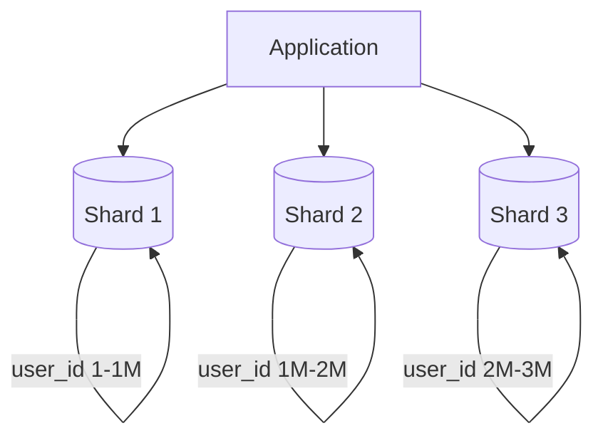

# Sharding and Partitioning

## Introduction

**Sharding** (or **partitioning**) splits data across multiple databases so each node holds a subset. It lets you **scale writes and storage** beyond a single machine.

## Why Shard?

- **Single DB limit**: One node has a ceiling on writes, storage, and connection count.
- **Sharding**: Distribute data by a **shard key** (e.g. user_id, tenant_id). Each shard is a separate database.

## Shard Key Choice

- **Critical**: Determines how evenly load and data are distributed.
- **Bad key**: All hot data in one shard (e.g. sharding by "country" when one country dominates).
- **Good key**: High cardinality, even access (e.g. user_id for user-centric data).

## Challenges

- **Cross-shard queries**: No SQL join across shards; do it in the app or avoid.
- **Rebalancing**: Adding shards or changing the key range requires moving data.
- **Hot shards**: One shard can still become a bottleneck if the key is skewed.

<Callout variant="tip" title="Consistent hashing">
Consistent hashing can assign keys to shards so that adding/removing shards moves only a fraction of keys.
</Callout>

## Summary

<SummaryBox title="Key takeaways">
- **Sharding** splits data across multiple DBs by a shard key to scale writes and storage.
- **Shard key** must have high cardinality and even distribution.
- Cross-shard queries and rebalancing add complexity; plan the key carefully.
</SummaryBox>
