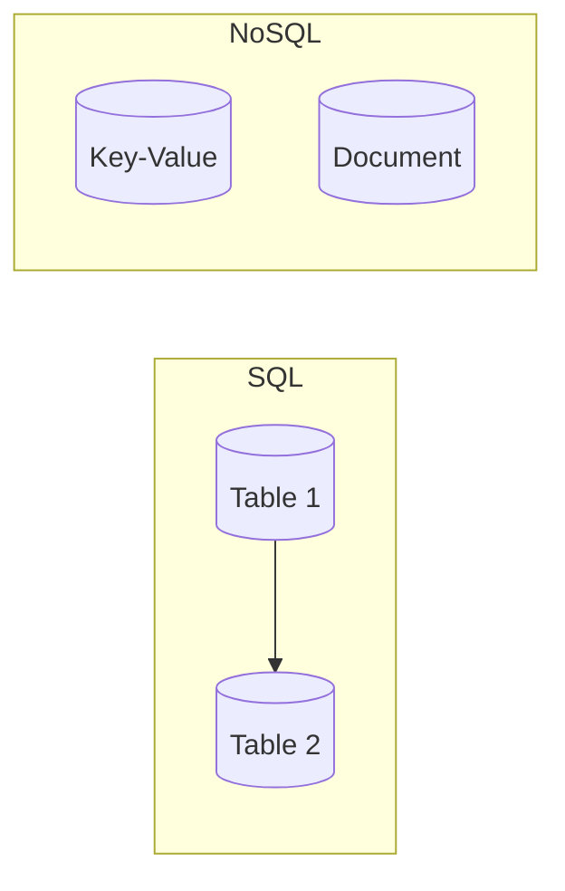

# SQL vs NoSQL Deep Dive

## Introduction

Choosing between SQL (relational) and NoSQL databases depends on your data model, consistency needs, and scale.

## SQL (Relational) Databases

- **Structured data**: Tables with fixed schema (columns and types).
- **ACID transactions**: Strong consistency; multiple operations in one transaction.
- **Relationships**: Joins across tables (e.g. users and orders).
- **Use when**: Complex queries, joins, strong consistency, and reporting.

## NoSQL Databases

- **Flexible or specialized**: Document (JSON), key-value, wide-column, graph.
- **Often eventually consistent**: Tune for availability and scale.
- **Scale-out**: Designed for horizontal scaling (sharding, distribution).
- **Use when**: High write throughput, flexible schema, or graph/tree data.

| Aspect | SQL | NoSQL |
|--------|-----|-------|
| Schema | Fixed | Flexible or none |
| Scaling | Often vertical first | Horizontal (sharding) |
| Consistency | Strong (ACID) | Often eventual |
| Joins | Native | Application-level or avoided |

## Summary

<SummaryBox title="Key takeaways">
- **SQL**: structured data, ACID, joins; good for consistency and complex queries.
- **NoSQL**: flexible schema, scale-out; good for high throughput and flexibility.
- Many systems use both: SQL for core data, NoSQL for cache or specialized stores.
</SummaryBox>
