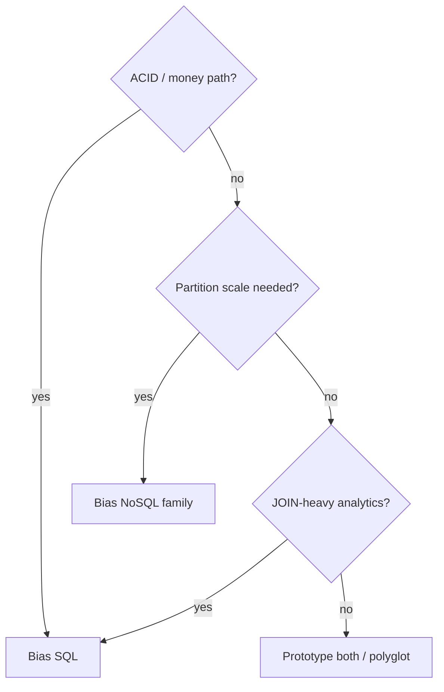

# SQL vs NoSQL Deep Dive

**When to use relational databases vs NoSQL** — beyond buzzwords. This page lines up **trade-offs**, **types**, and a **decision table** you can reuse in interviews.

For schema basics and ACID detail, see [Database Fundamentals](/learn/hld/database-fundamentals).

## The core difference

<MetricTable
  title="Spreadsheet vs filing cabinet"
  subtitle="Rough analogy — real systems mix patterns."
  columns={['Style', 'Analogy', 'Technical gist']}
  rows={[
    ['SQL (relational)', 'Excel: fixed columns; sheets link with formulas / keys', 'Tables, schema, FKs, JOINs, SQL — strong invariants + reporting'],
    ['NoSQL (families)', 'Folders of mixed documents; grab one folder fast', 'Models tuned for access pattern — scale-out, flexible shape, varied consistency'],
  ]}
/>

<MetricTable
  title="One-line definitions"
  columns={['Side', 'What it optimizes for']}
  compact
  rows={[
    ['SQL', 'Structured rows, relationships, declarative queries, ACID transactions (typical OLTP engines)'],
    ['NoSQL', 'Flexible or specialized shapes, partitionable workloads, throughput — consistency is **product-specific** (not “always eventual”)'],
  ]}
/>

## SQL: strengths

  
Why teams still default to SQL

  <ul className="list-inside list-disc space-y-2 text-sm text-muted-foreground">
    <li><strong className="text-foreground">ACID transactions</strong> — money, inventory, identity; all-or-nothing commits</li>
    <li><strong className="text-foreground">Complex queries</strong> — JOINs, aggregates, subqueries, window functions</li>
    <li><strong className="text-foreground">Strong consistency model</strong> — read-your-writes within transaction semantics you choose</li>
    <li><strong className="text-foreground">Mature ecosystem</strong> — backups, migrations, ORMs, BI tools, hiring pool</li>
  </ul>

<MetricTable
  title="Choose SQL when (rules of thumb)"
  columns={['Signal', 'Why']}
  compact
  accentLastColumn
  rows={[
    ['Clear entity relationships', 'Normalize; enforce FKs; avoid duplicate truth'],
    ['Ad-hoc analytics & reporting', 'SQL expresses slices without shipping new code per question'],
    ['ACID required', 'Ledger, payments, reservations — correctness over raw novelty'],
    ['Stable schema', 'Migrations are manageable; types and constraints protect data'],
  ]}
/>

## NoSQL: main types

<MetricTable
  title="Four families (not interchangeable)"
  columns={['Type', 'Examples', 'Shape', 'Often best for']}
  compact
  rows={[
    ['Document', 'MongoDB, CouchDB', 'JSON-like docs; flexible fields per record', 'Profiles, catalogs, CMS, evolving objects'],
    ['Key–value', 'Redis, DynamoDB, Memcached', 'Key → blob; minimal query model', 'Cache, sessions, rate limits, hot keys'],
    ['Wide-column', 'Cassandra, HBase, ScyllaDB', 'Partition key + sparse columns; huge write fan-out', 'Time-series, IoT, feed-like append logs'],
    ['Graph', 'Neo4j, Neptune', 'Nodes + edges; traversals first-class', 'Social graph, fraud rings, recommendations'],
  ]}
/>

## Head-to-head comparison

<MetricTable
  title="SQL vs NoSQL — interview table"
  subtitle="Exceptions exist (distributed SQL, transactional documents). State your assumptions."
  columns={['Aspect', 'Typical SQL', 'Typical NoSQL']}
  compact
  rows={[
    ['Schema', 'Fixed, migrated', 'Flexible or model-specific'],
    ['Scaling (first instinct)', 'Bigger machine, replicas; then sharding / federation', 'Partition by key; add nodes for shards'],
    ['Consistency', 'ACID; tunable isolation', 'From strong-per-doc to eventual — **read the docs**'],
    ['Queries', 'JOINs, SQL', 'Key/path, scans, DSLs — JOINs often app-side or avoided'],
    ['Best for', 'Transactions, reporting, invariants', 'Massive partitionable access, speed, specialized models'],
  ]}
/>

<Callout variant="tip" title="BASE (optional vocabulary)">
Some NoSQL talks cite **BASE** (Basically Available, Soft state, **Eventual** consistency) as a contrast to **ACID**. In practice many systems offer **tunable** consistency or **per-operation** guarantees — don’t treat “NoSQL = no transactions” as a law.
</Callout>

## Decision framework

Ask the questions **in order that matters for your product** — below is a common interview flow.

<MetricTable
  title="If / then (starting points)"
  columns={['Question', 'If yes / true', 'If no / false']}
  compact
  rows={[
    ['Need ACID for core workflows?', 'Start with **SQL** (or verify your NoSQL transaction story)', 'NoSQL **possible** — still validate durability & isolation needs'],
    ['Heavy many-to-many reporting & JOINs?', '**SQL** shines', 'Document + denorm, or CQRS / separate OLAP'],
    ['Must scale writes across many nodes?', 'Partition-friendly **NoSQL** (or sharded SQL with pain budget)', '**SQL** often simpler'],
    ['Schema changes weekly per tenant?', '**Document** or flexible models', '**SQL** + migrations if shape is still coherent'],
    ['Hot path is key get/put?', '**Key–value** (Redis, DynamoDB, …)', 'Wider model (**SQL** or document)'],
    ['Graph traversals are the product?', '**Graph** DB or specialized store', 'Recursive SQL works only to a point'],
  ]}
/>

## Polyglot persistence (real life)

<MetricTable
  title="Same product, multiple stores"
  subtitle="Different jobs — not a winner-take-all choice."
  columns={['Role', 'Typical pick']}
  rows={[
    ['System of record (orders, users)', 'PostgreSQL / MySQL-class SQL'],
    ['Cache & session', 'Redis / Memcached'],
    ['Search & facets', 'Elasticsearch, OpenSearch, …'],
    ['High-volume events', 'Kafka + warehouse, or wide-column / stream DB'],
  ]}
/>

<Callout variant="tip" title="Interview sound bite">
“I’d put **authoritative transactional state** in **Postgres**, **sessions** in **Redis**, and only add **Cassandra/Mongo/etc.** when we have a **measured** bottleneck or access pattern that fits.”
</Callout>

## Key takeaways

<SummaryBox title="SQL vs NoSQL deep dive — recap">
- **SQL** fits **structured relationships**, **complex queries**, and **ACID**-sensitive domains.
- **NoSQL** is a **basket of models** — document, KV, wide-column, graph — each for different **scale and shape** needs.
- **Document** for flexible records, **KV** for speed and simplicity, **graph** for relationship-heavy traversals.
- **Polyglot** stacks are normal: SQL for truth, NoSQL for cache, search, and scale-out slices.
- Decide from **access patterns and invariants**, not labels — **measure** before you shard.
</SummaryBox>
