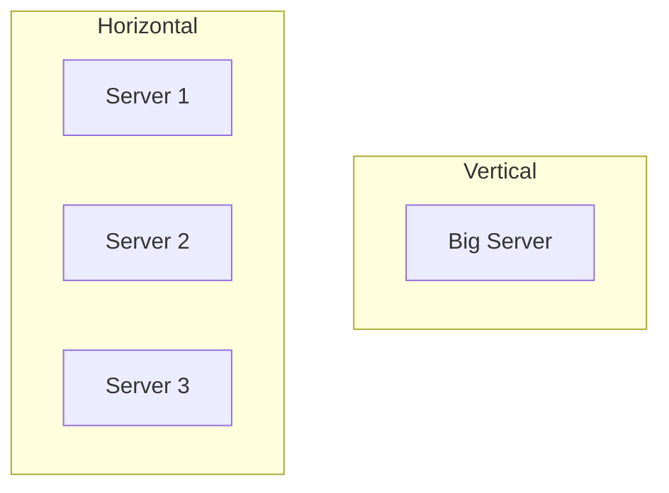

# Vertical vs Horizontal Scaling

## Introduction

**Scaling** means handling more load. You can scale **vertically** (bigger machine) or **horizontally** (more machines). The choice affects cost, limits, and architecture.

## Vertical Scaling (Scale Up)

Add more **CPU, RAM, or disk** to a single machine.

- **Pros**: Simpler (no distributed logic); no code change for stateless apps when you resize.
- **Cons**: Hard limit (biggest instance size); single point of failure; often more expensive per unit capacity at large sizes.

## Horizontal Scaling (Scale Out)

Add **more machines** and distribute load (and often data) across them.

- **Pros**: No single ceiling; can add capacity incrementally; often better cost curve at scale.
- **Cons**: Requires load balancing, stateless design (or shared state), and often distributed data (replication, sharding).

<Callout variant="tip" title="Cloud and scale">
In the cloud, horizontal scaling (auto-scaling groups, Kubernetes) is standard. Design stateless services so you can add or remove instances without special handling.
</Callout>

## When to Use Which

- **Vertical**: Quick fix; small or medium scale; single-node databases or legacy apps.
- **Horizontal**: Long-term growth; high availability; web/API tier and many data stores.

## Summary

<SummaryBox title="Key takeaways">
- **Vertical**: bigger machine; simpler but limited and single point of failure.
- **Horizontal**: more machines; scalable and resilient; needs load balancing and often stateless design.
- Prefer horizontal for production systems that must grow.
</SummaryBox>
