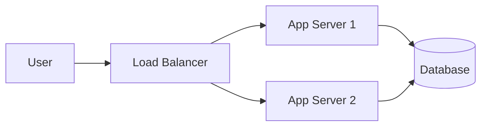

# What is System Design?

## Definition

**System design** is the process of defining the architecture, components, modules, interfaces, and data flow for a system to satisfy specified requirements. It is a critical skill for building scalable, reliable, and maintainable applications.

## Why System Design Matters

<Callout variant="tip" title="Why this skill pays off">
System design rounds are common in senior and staff engineer interviews. The ability to design systems that scale saves companies millions and prevents outages.
</Callout>

- **Interview staple**: System design rounds are common at top tech companies.
- **Real-world impact**: Designing systems that scale saves cost and prevents outages.
- **Technical leadership**: Senior engineers make architecture decisions and trade-offs.

## Key Goals

1. **Scalability** — Handle growth in users, data, and traffic.
2. **Reliability** — Availability and correctness under failures.
3. **Performance** — Low latency and high throughput where required.
4. **Maintainability** — Clear boundaries so the system can evolve.
5. **Cost-effectiveness** — Balance infrastructure and engineering cost.

## High-Level Architecture Example

<DiagramBlock
  chart="sequenceDiagram
    participant User
    participant LB as Load Balancer
    participant App as App Server
    participant DB as Database
    User->>LB: Request
    LB->>App: Forward
    App->>DB: Query
    DB-->>App: Result
    App-->>LB: Response
    LB-->>User: Response"
  title="Request flow: User to Load Balancer to App Server to Database"
/>

## Summary

<SummaryBox title="Key takeaways">
- System design is defining architecture and components to meet requirements.
- Goals: scalability, reliability, performance, maintainability, cost.
- Simple architecture: User to Load Balancer to App Server(s) to Database.
- As systems grow, add caching, queues, and more services.
</SummaryBox>
